# 13 - Diagramas fuente (Mermaid)

Código Mermaid de los diagramas descritos en `12-insumos-diagramas.md`. Cada bloque lleva un título interno (cabecera `---` `title:`) y el mismo identificador que usa el documento 12 (CU-xx, CL-xx, ER-xx, PK-xx, C4-xx, DP-xx, SQ-xx, AC-xx, ST-xx). Sin comentarios ni emojis dentro del código. Los diagramas grandes se dividen en partes.

## Notas de uso

- Probado solo por lectura de sintaxis: no se ejecutó ningún renderizador (no hay build ni internet en este análisis). Si un bloque falla en el renderizador de la monografía, el primer sospechoso son los acentos en identificadores; las etiquetas visibles van entre comillas y no son identificadores.
- Mermaid no trae diagrama nativo de casos de uso, de BPMN ni de C4 estable. Se resolvió así: casos de uso = `flowchart` con actores como rectángulos y casos como óvalos (`([ ])`), con aristas punteadas rotuladas `include` y `extend` (la flecha de `extend` sale del caso que extiende hacia el caso base; la de `include` sale del caso base hacia el incluido) y aristas continuas rotuladas `especializa` para la generalización; C4 = `flowchart` con subgrafos; actividades y BPMN = `flowchart` con una calle (subgrafo) por actor, rombos para decisiones y óvalos para inicio y fin.
- Etiquetas de origen: [BASE] = prototipo de Julián David Camacho Erazo; [EXTENSIÓN] = trabajo de grado. Van en el título del diagrama o en el nombre del subgrafo.
- Cada diagrama tiene su evidencia y sus supuestos en `12-insumos-diagramas.md` (misma numeración).

Índice: CU-01 a CU-05 (casos de uso), CL-01 a CL-08 y ER-01 (clases y modelo relacional), PK-01 y C4-01 a C4-05 (paquetes y C4), DP-01 (despliegue), SQ-01 a SQ-10 (secuencias), AC-01 a AC-04 (actividades), ST-01 a ST-06 (estados). Total: 41 diagramas.

---

## 1. Casos de uso

### CU-01 Estudiante [EXTENSIÓN]

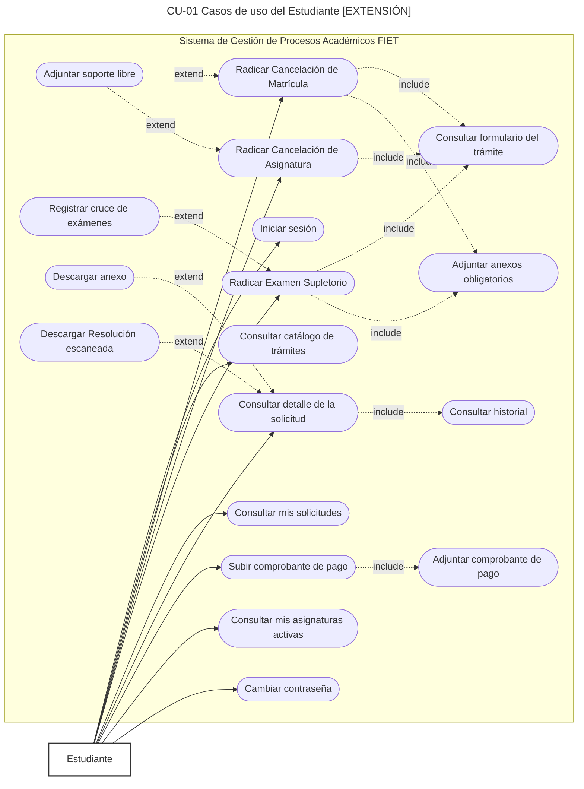
```mermaid
---
title: CU-01 Casos de uso del Estudiante [EXTENSIÓN]
---
flowchart LR
    EST["Estudiante"]:::actor
    subgraph SIS["Sistema de Gestión de Procesos Académicos FIET"]
        U01(["Iniciar sesión"])
        U02(["Consultar catálogo de trámites"])
        U03(["Radicar Cancelación de Matrícula"])
        U04(["Radicar Cancelación de Asignatura"])
        U05(["Radicar Examen Supletorio"])
        U06(["Consultar formulario del trámite"])
        U07(["Adjuntar anexos obligatorios"])
        U08(["Adjuntar soporte libre"])
        U09(["Registrar cruce de exámenes"])
        U10(["Consultar mis solicitudes"])
        U11(["Consultar detalle de la solicitud"])
        U12(["Consultar historial"])
        U13(["Descargar anexo"])
        U14(["Descargar Resolución escaneada"])
        U15(["Subir comprobante de pago"])
        U16(["Adjuntar comprobante de pago"])
        U17(["Consultar mis asignaturas activas"])
        U18(["Cambiar contraseña"])
    end
    EST --> U01
    EST --> U02
    EST --> U03
    EST --> U04
    EST --> U05
    EST --> U10
    EST --> U11
    EST --> U15
    EST --> U17
    EST --> U18
    U03 -.->|include| U06
    U03 -.->|include| U07
    U04 -.->|include| U06
    U05 -.->|include| U06
    U05 -.->|include| U07
    U08 -.->|extend| U03
    U08 -.->|extend| U04
    U09 -.->|extend| U05
    U11 -.->|include| U12
    U13 -.->|extend| U11
    U14 -.->|extend| U11
    U15 -.->|include| U16
    classDef actor fill:#ffffff,stroke:#333333,stroke-width:2px
```

### CU-02 Funcionario Académico [EXTENSIÓN]

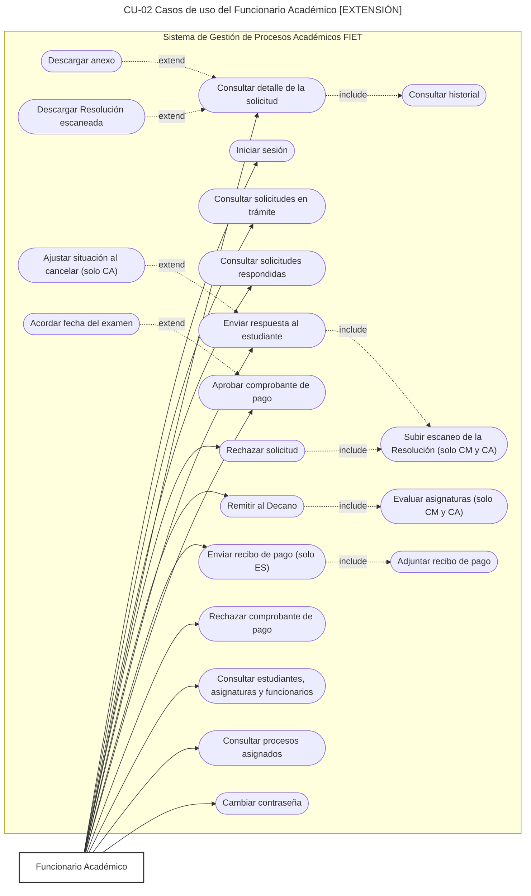
```mermaid
---
title: CU-02 Casos de uso del Funcionario Académico [EXTENSIÓN]
---
flowchart LR
    FA["Funcionario Académico"]:::actor
    subgraph SIS["Sistema de Gestión de Procesos Académicos FIET"]
        F01(["Iniciar sesión"])
        F02(["Consultar solicitudes en trámite"])
        F03(["Consultar solicitudes respondidas"])
        F04(["Consultar detalle de la solicitud"])
        F05(["Consultar historial"])
        F06(["Descargar anexo"])
        F07(["Descargar Resolución escaneada"])
        F08(["Rechazar solicitud"])
        F09(["Subir escaneo de la Resolución (solo CM y CA)"])
        F10(["Remitir al Decano"])
        F11(["Evaluar asignaturas (solo CM y CA)"])
        F12(["Enviar respuesta al estudiante"])
        F13(["Ajustar situación al cancelar (solo CA)"])
        F14(["Enviar recibo de pago (solo ES)"])
        F15(["Adjuntar recibo de pago"])
        F16(["Aprobar comprobante de pago"])
        F17(["Acordar fecha del examen"])
        F18(["Rechazar comprobante de pago"])
        F19(["Consultar estudiantes, asignaturas y funcionarios"])
        F20(["Consultar procesos asignados"])
        F21(["Cambiar contraseña"])
    end
    FA --> F01
    FA --> F02
    FA --> F03
    FA --> F04
    FA --> F08
    FA --> F10
    FA --> F12
    FA --> F14
    FA --> F16
    FA --> F18
    FA --> F19
    FA --> F20
    FA --> F21
    F04 -.->|include| F05
    F06 -.->|extend| F04
    F07 -.->|extend| F04
    F08 -.->|include| F09
    F10 -.->|include| F11
    F12 -.->|include| F09
    F13 -.->|extend| F12
    F14 -.->|include| F15
    F17 -.->|extend| F16
    classDef actor fill:#ffffff,stroke:#333333,stroke-width:2px
```

### CU-03 Decano, procesos académicos [EXTENSIÓN]

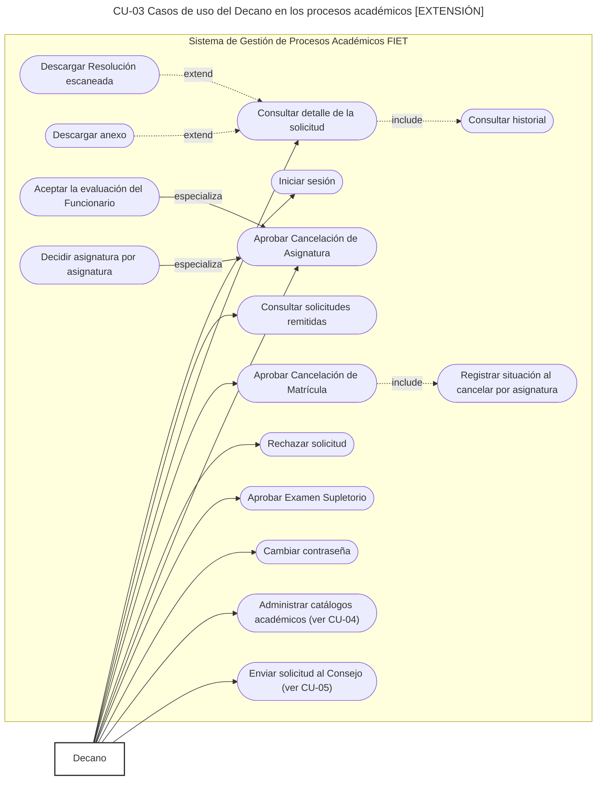
```mermaid
---
title: CU-03 Casos de uso del Decano en los procesos académicos [EXTENSIÓN]
---
flowchart LR
    DEC["Decano"]:::actor
    subgraph SIS["Sistema de Gestión de Procesos Académicos FIET"]
        D01(["Iniciar sesión"])
        D02(["Consultar solicitudes remitidas"])
        D03(["Consultar detalle de la solicitud"])
        D04(["Consultar historial"])
        D05(["Descargar Resolución escaneada"])
        D06(["Descargar anexo"])
        D07(["Aprobar Cancelación de Matrícula"])
        D08(["Registrar situación al cancelar por asignatura"])
        D09(["Rechazar solicitud"])
        D10(["Aprobar Cancelación de Asignatura"])
        D11(["Aceptar la evaluación del Funcionario"])
        D12(["Decidir asignatura por asignatura"])
        D13(["Aprobar Examen Supletorio"])
        D14(["Cambiar contraseña"])
        D15(["Administrar catálogos académicos (ver CU-04)"])
        D16(["Enviar solicitud al Consejo (ver CU-05)"])
    end
    DEC --> D01
    DEC --> D02
    DEC --> D03
    DEC --> D07
    DEC --> D09
    DEC --> D10
    DEC --> D13
    DEC --> D14
    DEC --> D15
    DEC --> D16
    D03 -.->|include| D04
    D05 -.->|extend| D03
    D06 -.->|extend| D03
    D07 -.->|include| D08
    D11 -->|especializa| D10
    D12 -->|especializa| D10
    classDef actor fill:#ffffff,stroke:#333333,stroke-width:2px
```

### CU-04 Administración académica (Decano y Secretario General) [EXTENSIÓN]

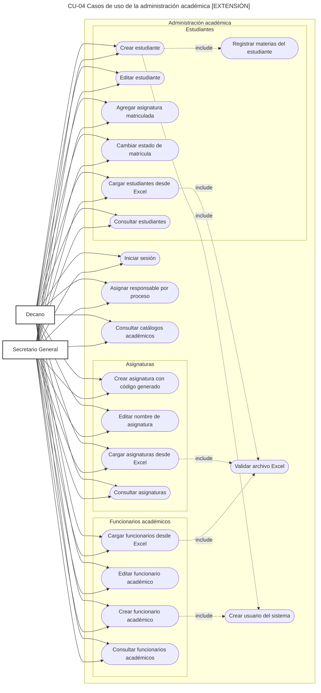
```mermaid
---
title: CU-04 Casos de uso de la administración académica [EXTENSIÓN]
---
flowchart LR
    DEC["Decano"]:::actor
    SG["Secretario General"]:::actor
    subgraph SIS["Administración académica"]
        A01(["Iniciar sesión"])
        subgraph ASI["Asignaturas"]
            A02(["Crear asignatura con código generado"])
            A03(["Editar nombre de asignatura"])
            A04(["Cargar asignaturas desde Excel"])
            A05(["Consultar asignaturas"])
        end
        subgraph EST["Estudiantes"]
            A06(["Crear estudiante"])
            A07(["Registrar materias del estudiante"])
            A08(["Editar estudiante"])
            A09(["Agregar asignatura matriculada"])
            A10(["Cambiar estado de matrícula"])
            A11(["Cargar estudiantes desde Excel"])
            A12(["Consultar estudiantes"])
        end
        subgraph FUN["Funcionarios académicos"]
            A13(["Crear funcionario académico"])
            A14(["Editar funcionario académico"])
            A15(["Cargar funcionarios desde Excel"])
            A16(["Consultar funcionarios académicos"])
        end
        A17(["Asignar responsable por proceso"])
        A18(["Validar archivo Excel"])
        A19(["Crear usuario del sistema"])
        A20(["Consultar catálogos académicos"])
    end
    DEC --> A01
    SG --> A01
    DEC --> A02
    SG --> A02
    DEC --> A03
    SG --> A03
    DEC --> A04
    SG --> A04
    DEC --> A05
    SG --> A05
    DEC --> A06
    SG --> A06
    DEC --> A08
    SG --> A08
    DEC --> A09
    SG --> A09
    DEC --> A10
    SG --> A10
    DEC --> A11
    SG --> A11
    DEC --> A12
    SG --> A12
    DEC --> A13
    SG --> A13
    DEC --> A14
    SG --> A14
    DEC --> A15
    SG --> A15
    DEC --> A16
    SG --> A16
    DEC --> A17
    SG --> A17
    DEC --> A20
    SG --> A20
    A06 -.->|include| A07
    A06 -.->|include| A19
    A13 -.->|include| A19
    A04 -.->|include| A18
    A11 -.->|include| A18
    A15 -.->|include| A18
    classDef actor fill:#ffffff,stroke:#333333,stroke-width:2px
```

### CU-05 Gestión del Consejo de Facultad [BASE]

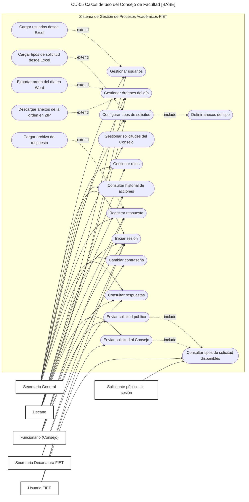
```mermaid
---
title: CU-05 Casos de uso del Consejo de Facultad [BASE]
---
flowchart LR
    SG["Secretario General"]:::actor
    DEC["Decano"]:::actor
    FUN["Funcionario (Consejo)"]:::actor
    SFI["Secretaria Decanatura FIET"]:::actor
    UFI["Usuario FIET"]:::actor
    PUB["Solicitante público sin sesión"]:::actor
    subgraph SIS["Sistema de Gestión de Procesos Académicos FIET"]
        B01(["Iniciar sesión"])
        B02(["Gestionar usuarios"])
        B03(["Cargar usuarios desde Excel"])
        B04(["Gestionar roles"])
        B05(["Consultar historial de acciones"])
        B06(["Configurar tipos de solicitud"])
        B07(["Cargar tipos de solicitud desde Excel"])
        B08(["Definir anexos del tipo"])
        B09(["Gestionar órdenes del día"])
        B10(["Exportar orden del día en Word"])
        B11(["Descargar anexos de la orden en ZIP"])
        B12(["Gestionar solicitudes del Consejo"])
        B13(["Registrar respuesta"])
        B14(["Cargar archivo de respuesta"])
        B15(["Consultar respuestas"])
        B16(["Enviar solicitud al Consejo"])
        B17(["Enviar solicitud pública"])
        B18(["Consultar tipos de solicitud disponibles"])
        B19(["Cambiar contraseña"])
    end
    SG --> B01
    DEC --> B01
    FUN --> B01
    SFI --> B01
    UFI --> B01
    SG --> B02
    DEC --> B02
    SG --> B04
    DEC --> B04
    SG --> B05
    DEC --> B05
    SG --> B06
    DEC --> B06
    SG --> B09
    DEC --> B09
    SG --> B12
    SG --> B13
    DEC --> B13
    FUN --> B13
    SG --> B15
    FUN --> B15
    SFI --> B15
    UFI --> B16
    DEC --> B16
    FUN --> B17
    PUB --> B18
    UFI --> B18
    SG --> B19
    FUN --> B19
    B03 -.->|extend| B02
    B07 -.->|extend| B06
    B06 -.->|include| B08
    B10 -.->|extend| B09
    B11 -.->|extend| B09
    B14 -.->|extend| B13
    B16 -.->|include| B18
    B17 -.->|include| B18
    classDef actor fill:#ffffff,stroke:#333333,stroke-width:2px
```

---

## 2. Clases de dominio y modelo relacional

### CL-01 Usuarios, roles y tipos de usuario [BASE]

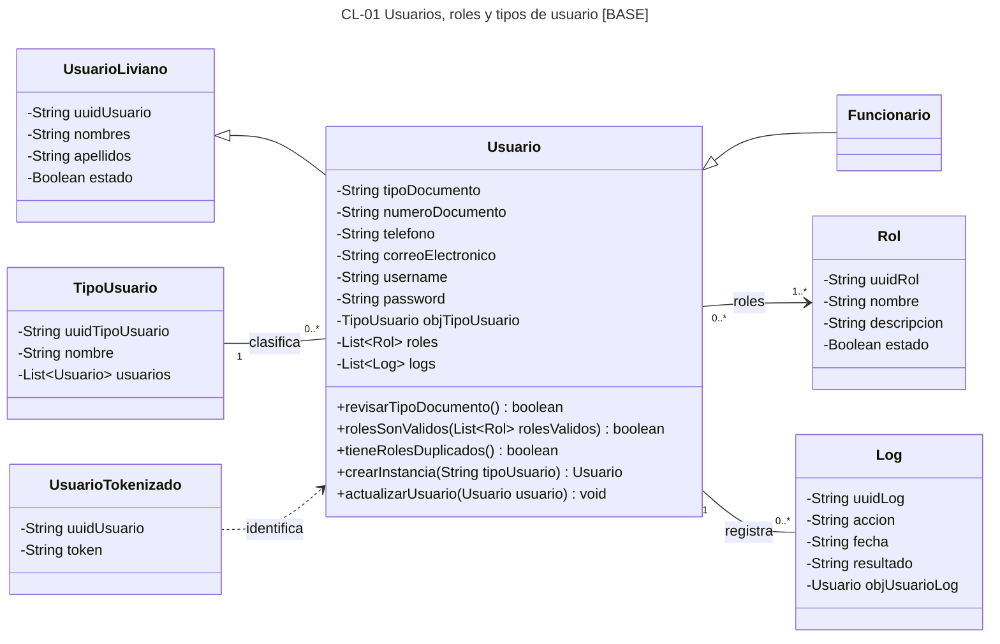
```mermaid
---
title: CL-01 Usuarios, roles y tipos de usuario [BASE]
---
classDiagram
    direction LR
    class UsuarioLiviano {
        -String uuidUsuario
        -String nombres
        -String apellidos
        -Boolean estado
    }
    class Usuario {
        -String tipoDocumento
        -String numeroDocumento
        -String telefono
        -String correoElectronico
        -String username
        -String password
        -TipoUsuario objTipoUsuario
        -List~Rol~ roles
        -List~Log~ logs
        +revisarTipoDocumento() boolean
        +rolesSonValidos(List~Rol~ rolesValidos) boolean
        +tieneRolesDuplicados() boolean
        +crearInstancia(String tipoUsuario) Usuario
        +actualizarUsuario(Usuario usuario) void
    }
    class Funcionario {
    }
    class TipoUsuario {
        -String uuidTipoUsuario
        -String nombre
        -List~Usuario~ usuarios
    }
    class Rol {
        -String uuidRol
        -String nombre
        -String descripcion
        -Boolean estado
    }
    class Log {
        -String uuidLog
        -String accion
        -String fecha
        -String resultado
        -Usuario objUsuarioLog
    }
    class UsuarioTokenizado {
        -String uuidUsuario
        -String token
    }
    UsuarioLiviano <|-- Usuario
    Usuario <|-- Funcionario
    TipoUsuario "1" -- "0..*" Usuario : clasifica
    Usuario "0..*" --> "1..*" Rol : roles
    Usuario "1" -- "0..*" Log : registra
    UsuarioTokenizado ..> Usuario : identifica
```

### CL-02 Estructura académica [EXTENSIÓN]

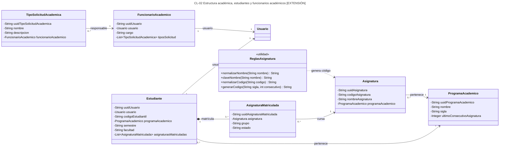
```mermaid
---
title: CL-02 Estructura académica, estudiantes y funcionarios académicos [EXTENSIÓN]
---
classDiagram
    direction LR
    class Usuario {
    }
    class ProgramaAcademico {
        -String uuidProgramaAcademico
        -String nombre
        -String sigla
        -Integer ultimoConsecutivoAsignatura
    }
    class Asignatura {
        -String uuidAsignatura
        -String codigoAsignatura
        -String nombreAsignatura
        -ProgramaAcademico programaAcademico
    }
    class AsignaturaMatriculada {
        -String uuidAsignaturaMatriculada
        -Asignatura asignatura
        -String grupo
        -String estado
    }
    class Estudiante {
        -String uuidUsuario
        -Usuario usuario
        -String codigoEstudiantil
        -ProgramaAcademico programaAcademico
        -String semestre
        -String facultad
        -List~AsignaturaMatriculada~ asignaturasMatriculadas
    }
    class FuncionarioAcademico {
        -String uuidUsuario
        -Usuario usuario
        -String cargo
        -List~TipoSolicitudAcademica~ tiposSolicitud
    }
    class TipoSolicitudAcademica {
        -String uuidTipoSolicitudAcademica
        -String nombre
        -String descripcion
        -FuncionarioAcademico funcionarioAcademico
    }
    class ReglasAsignatura {
        <<utilidad>>
        +normalizarNombre(String nombre) String
        +claveNombre(String nombre) String
        +normalizarCodigo(String codigo) String
        +generarCodigo(String sigla, int consecutivo) String
    }
    Estudiante "1" --> "1" Usuario : usuario
    FuncionarioAcademico "1" --> "1" Usuario : usuario
    Estudiante "0..*" --> "1" ProgramaAcademico : pertenece
    Asignatura "0..*" --> "1" ProgramaAcademico : pertenece
    Estudiante "1" *-- "0..*" AsignaturaMatriculada : matrícula
    AsignaturaMatriculada "0..*" --> "1" Asignatura : cursa
    TipoSolicitudAcademica "0..*" --> "1" FuncionarioAcademico : responsable
    ReglasAsignatura ..> Asignatura : genera código
```

### CL-03 Núcleo de la solicitud académica [EXTENSIÓN]

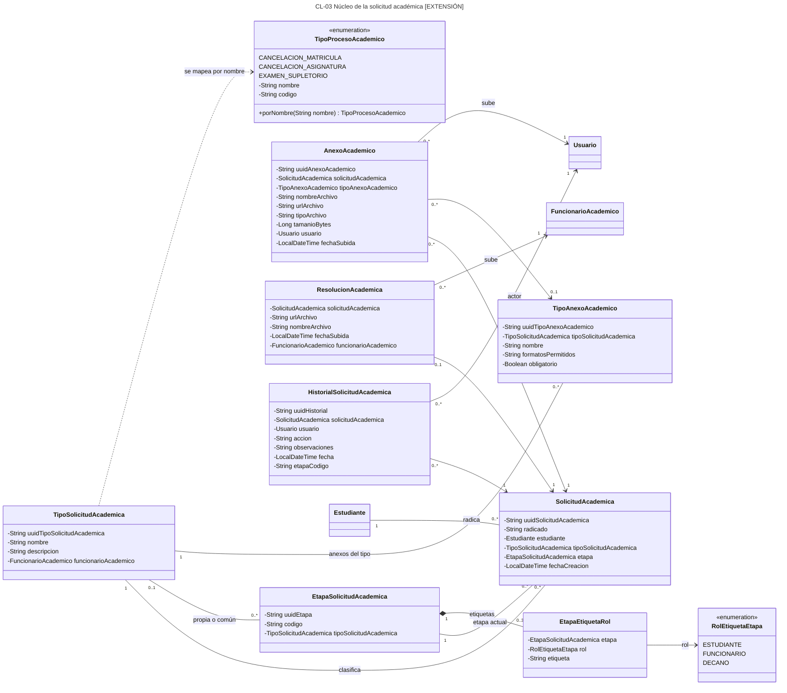
```mermaid
---
title: CL-03 Núcleo de la solicitud académica [EXTENSIÓN]
---
classDiagram
    direction LR
    class SolicitudAcademica {
        -String uuidSolicitudAcademica
        -String radicado
        -Estudiante estudiante
        -TipoSolicitudAcademica tipoSolicitudAcademica
        -EtapaSolicitudAcademica etapa
        -LocalDateTime fechaCreacion
    }
    class TipoSolicitudAcademica {
        -String uuidTipoSolicitudAcademica
        -String nombre
        -String descripcion
        -FuncionarioAcademico funcionarioAcademico
    }
    class EtapaSolicitudAcademica {
        -String uuidEtapa
        -String codigo
        -TipoSolicitudAcademica tipoSolicitudAcademica
    }
    class EtapaEtiquetaRol {
        -EtapaSolicitudAcademica etapa
        -RolEtiquetaEtapa rol
        -String etiqueta
    }
    class TipoAnexoAcademico {
        -String uuidTipoAnexoAcademico
        -TipoSolicitudAcademica tipoSolicitudAcademica
        -String nombre
        -String formatosPermitidos
        -Boolean obligatorio
    }
    class AnexoAcademico {
        -String uuidAnexoAcademico
        -SolicitudAcademica solicitudAcademica
        -TipoAnexoAcademico tipoAnexoAcademico
        -String nombreArchivo
        -String urlArchivo
        -String tipoArchivo
        -Long tamanioBytes
        -Usuario usuario
        -LocalDateTime fechaSubida
    }
    class ResolucionAcademica {
        -SolicitudAcademica solicitudAcademica
        -String urlArchivo
        -String nombreArchivo
        -LocalDateTime fechaSubida
        -FuncionarioAcademico funcionarioAcademico
    }
    class HistorialSolicitudAcademica {
        -String uuidHistorial
        -SolicitudAcademica solicitudAcademica
        -Usuario usuario
        -String accion
        -String observaciones
        -LocalDateTime fecha
        -String etapaCodigo
    }
    class Estudiante {
    }
    class Usuario {
    }
    class FuncionarioAcademico {
    }
    class RolEtiquetaEtapa {
        <<enumeration>>
        ESTUDIANTE
        FUNCIONARIO
        DECANO
    }
    class TipoProcesoAcademico {
        <<enumeration>>
        CANCELACION_MATRICULA
        CANCELACION_ASIGNATURA
        EXAMEN_SUPLETORIO
        -String nombre
        -String codigo
        +porNombre(String nombre) TipoProcesoAcademico
    }
    Estudiante "1" -- "0..*" SolicitudAcademica : radica
    TipoSolicitudAcademica "1" -- "0..*" SolicitudAcademica : clasifica
    EtapaSolicitudAcademica "1" -- "0..*" SolicitudAcademica : etapa actual
    TipoSolicitudAcademica "0..1" -- "0..*" EtapaSolicitudAcademica : propia o común
    EtapaSolicitudAcademica "1" *-- "0..3" EtapaEtiquetaRol : etiquetas
    EtapaEtiquetaRol --> RolEtiquetaEtapa : rol
    TipoSolicitudAcademica "1" -- "0..*" TipoAnexoAcademico : anexos del tipo
    AnexoAcademico "0..*" --> "1" SolicitudAcademica
    AnexoAcademico "0..*" --> "0..1" TipoAnexoAcademico
    AnexoAcademico "0..*" --> "1" Usuario : sube
    ResolucionAcademica "0..1" --> "1" SolicitudAcademica
    ResolucionAcademica "0..*" --> "1" FuncionarioAcademico : sube
    HistorialSolicitudAcademica "0..*" --> "1" SolicitudAcademica
    HistorialSolicitudAcademica "0..*" --> "1" Usuario : actor
    TipoSolicitudAcademica ..> TipoProcesoAcademico : se mapea por nombre
```

### CL-04 Especializaciones por proceso y evaluación por asignatura [EXTENSIÓN]

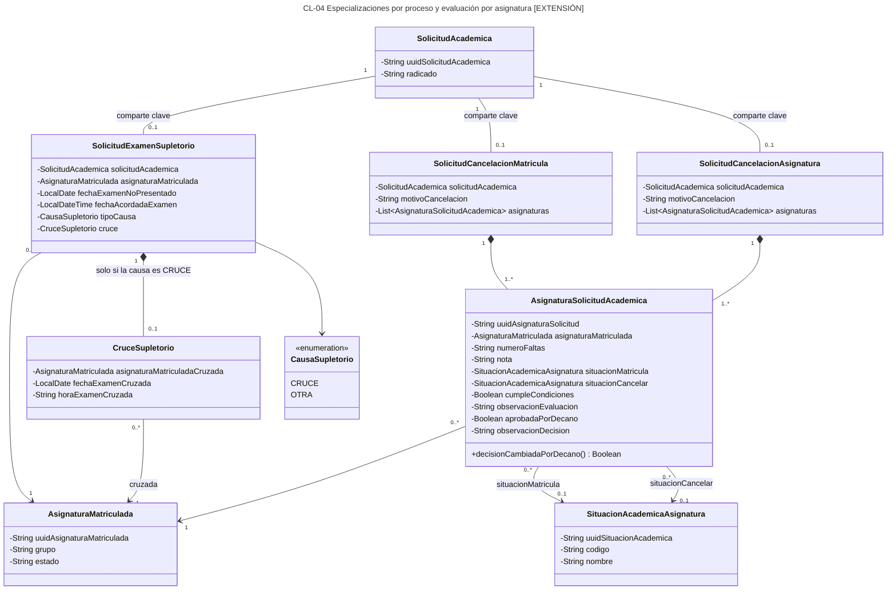
```mermaid
---
title: CL-04 Especializaciones por proceso y evaluación por asignatura [EXTENSIÓN]
---
classDiagram
    direction TB
    class SolicitudAcademica {
        -String uuidSolicitudAcademica
        -String radicado
    }
    class SolicitudCancelacionMatricula {
        -SolicitudAcademica solicitudAcademica
        -String motivoCancelacion
        -List~AsignaturaSolicitudAcademica~ asignaturas
    }
    class SolicitudCancelacionAsignatura {
        -SolicitudAcademica solicitudAcademica
        -String motivoCancelacion
        -List~AsignaturaSolicitudAcademica~ asignaturas
    }
    class SolicitudExamenSupletorio {
        -SolicitudAcademica solicitudAcademica
        -AsignaturaMatriculada asignaturaMatriculada
        -LocalDate fechaExamenNoPresentado
        -LocalDateTime fechaAcordadaExamen
        -CausaSupletorio tipoCausa
        -CruceSupletorio cruce
    }
    class CruceSupletorio {
        -AsignaturaMatriculada asignaturaMatriculadaCruzada
        -LocalDate fechaExamenCruzada
        -String horaExamenCruzada
    }
    class AsignaturaSolicitudAcademica {
        -String uuidAsignaturaSolicitud
        -AsignaturaMatriculada asignaturaMatriculada
        -String numeroFaltas
        -String nota
        -SituacionAcademicaAsignatura situacionMatricula
        -SituacionAcademicaAsignatura situacionCancelar
        -Boolean cumpleCondiciones
        -String observacionEvaluacion
        -Boolean aprobadaPorDecano
        -String observacionDecision
        +decisionCambiadaPorDecano() Boolean
    }
    class SituacionAcademicaAsignatura {
        -String uuidSituacionAcademica
        -String codigo
        -String nombre
    }
    class AsignaturaMatriculada {
        -String uuidAsignaturaMatriculada
        -String grupo
        -String estado
    }
    class CausaSupletorio {
        <<enumeration>>
        CRUCE
        OTRA
    }
    SolicitudAcademica "1" -- "0..1" SolicitudCancelacionMatricula : comparte clave
    SolicitudAcademica "1" -- "0..1" SolicitudCancelacionAsignatura : comparte clave
    SolicitudAcademica "1" -- "0..1" SolicitudExamenSupletorio : comparte clave
    SolicitudCancelacionMatricula "1" *-- "1..*" AsignaturaSolicitudAcademica
    SolicitudCancelacionAsignatura "1" *-- "1..*" AsignaturaSolicitudAcademica
    SolicitudExamenSupletorio "1" *-- "0..1" CruceSupletorio : solo si la causa es CRUCE
    SolicitudExamenSupletorio "0..*" --> "1" AsignaturaMatriculada
    SolicitudExamenSupletorio --> CausaSupletorio
    CruceSupletorio "0..*" --> "1" AsignaturaMatriculada : cruzada
    AsignaturaSolicitudAcademica "0..*" --> "1" AsignaturaMatriculada
    AsignaturaSolicitudAcademica "0..*" --> "0..1" SituacionAcademicaAsignatura : situacionMatricula
    AsignaturaSolicitudAcademica "0..*" --> "0..1" SituacionAcademicaAsignatura : situacionCancelar
```

### CL-05 Modelos de lectura y formularios [EXTENSIÓN]

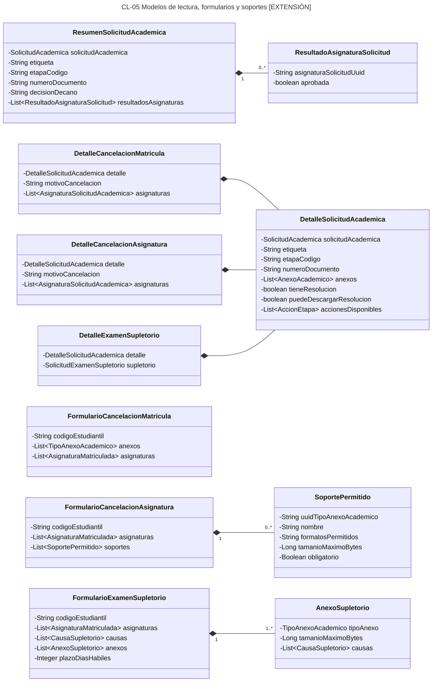
```mermaid
---
title: CL-05 Modelos de lectura, formularios y soportes [EXTENSIÓN]
---
classDiagram
    direction LR
    class DetalleSolicitudAcademica {
        -SolicitudAcademica solicitudAcademica
        -String etiqueta
        -String etapaCodigo
        -String numeroDocumento
        -List~AnexoAcademico~ anexos
        -boolean tieneResolucion
        -boolean puedeDescargarResolucion
        -List~AccionEtapa~ accionesDisponibles
    }
    class ResumenSolicitudAcademica {
        -SolicitudAcademica solicitudAcademica
        -String etiqueta
        -String etapaCodigo
        -String numeroDocumento
        -String decisionDecano
        -List~ResultadoAsignaturaSolicitud~ resultadosAsignaturas
    }
    class ResultadoAsignaturaSolicitud {
        -String asignaturaSolicitudUuid
        -boolean aprobada
    }
    class DetalleCancelacionMatricula {
        -DetalleSolicitudAcademica detalle
        -String motivoCancelacion
        -List~AsignaturaSolicitudAcademica~ asignaturas
    }
    class DetalleCancelacionAsignatura {
        -DetalleSolicitudAcademica detalle
        -String motivoCancelacion
        -List~AsignaturaSolicitudAcademica~ asignaturas
    }
    class DetalleExamenSupletorio {
        -DetalleSolicitudAcademica detalle
        -SolicitudExamenSupletorio supletorio
    }
    class FormularioCancelacionMatricula {
        -String codigoEstudiantil
        -List~TipoAnexoAcademico~ anexos
        -List~AsignaturaMatriculada~ asignaturas
    }
    class FormularioCancelacionAsignatura {
        -String codigoEstudiantil
        -List~AsignaturaMatriculada~ asignaturas
        -List~SoportePermitido~ soportes
    }
    class FormularioExamenSupletorio {
        -String codigoEstudiantil
        -List~AsignaturaMatriculada~ asignaturas
        -List~CausaSupletorio~ causas
        -List~AnexoSupletorio~ anexos
        -Integer plazoDiasHabiles
    }
    class AnexoSupletorio {
        -TipoAnexoAcademico tipoAnexo
        -Long tamanioMaximoBytes
        -List~CausaSupletorio~ causas
    }
    class SoportePermitido {
        -String uuidTipoAnexoAcademico
        -String nombre
        -String formatosPermitidos
        -Long tamanioMaximoBytes
        -Boolean obligatorio
    }
    DetalleCancelacionMatricula *-- DetalleSolicitudAcademica
    DetalleCancelacionAsignatura *-- DetalleSolicitudAcademica
    DetalleExamenSupletorio *-- DetalleSolicitudAcademica
    ResumenSolicitudAcademica "1" *-- "0..*" ResultadoAsignaturaSolicitud
    FormularioCancelacionAsignatura "1" *-- "0..*" SoportePermitido
    FormularioExamenSupletorio "1" *-- "1..*" AnexoSupletorio
```

### CL-06 Modelos de comando y servicios de dominio [EXTENSIÓN]

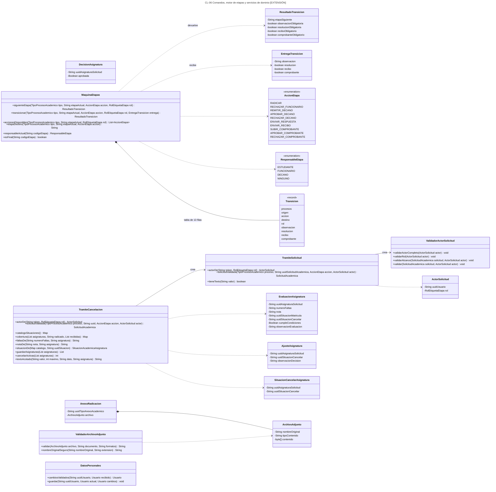
```mermaid
---
title: CL-06 Comandos, motor de etapas y servicios de dominio [EXTENSIÓN]
---
classDiagram
    direction LR
    class AccionEtapa {
        <<enumeration>>
        RADICAR
        RECHAZAR_FUNCIONARIO
        REMITIR_DECANO
        APROBAR_DECANO
        RECHAZAR_DECANO
        ENVIAR_RESPUESTA
        ENVIAR_RECIBO
        SUBIR_COMPROBANTE
        APROBAR_COMPROBANTE
        RECHAZAR_COMPROBANTE
    }
    class ResponsableEtapa {
        <<enumeration>>
        ESTUDIANTE
        FUNCIONARIO
        DECANO
        NINGUNO
    }
    class ActorSolicitud {
        -String uuidUsuario
        -RolEtiquetaEtapa rol
    }
    class EntregaTransicion {
        -String observacion
        -boolean resolucion
        -boolean recibo
        -boolean comprobante
    }
    class ResultadoTransicion {
        -String etapaSiguiente
        -boolean observacionObligatoria
        -boolean resolucionObligatoria
        -boolean reciboObligatorio
        -boolean comprobanteObligatorio
    }
    class EvaluacionAsignatura {
        -String uuidAsignaturaSolicitud
        -String numeroFaltas
        -String nota
        -String uuidSituacionMatricula
        -String uuidSituacionCancelar
        -Boolean cumpleCondiciones
        -String observacionEvaluacion
    }
    class DecisionAsignatura {
        -String uuidAsignaturaSolicitud
        -Boolean aprobada
    }
    class AjusteAsignatura {
        -String uuidAsignaturaSolicitud
        -String uuidSituacionCancelar
        -String observacionDecision
    }
    class SituacionCancelarAsignatura {
        -String uuidAsignaturaSolicitud
        -String uuidSituacionCancelar
    }
    class ArchivoAdjunto {
        -String nombreOriginal
        -String tipoContenido
        -byte[] contenido
    }
    class AnexoRadicacion {
        -String uuidTipoAnexoAcademico
        -ArchivoAdjunto archivo
    }
    class MaquinaEtapas {
        +siguienteEtapa(TipoProcesoAcademico tipo, String etapaActual, AccionEtapa accion, RolEtiquetaEtapa rol) ResultadoTransicion
        +transicionar(TipoProcesoAcademico tipo, String etapaActual, AccionEtapa accion, RolEtiquetaEtapa rol, EntregaTransicion entrega) ResultadoTransicion
        +accionesDisponibles(TipoProcesoAcademico tipo, String etapaActual, RolEtiquetaEtapa rol) List~AccionEtapa~
        +etapaDestino(TipoProcesoAcademico tipo, String etapaActual, AccionEtapa accion) String
        +responsableActual(String codigoEtapa) ResponsableEtapa
        +esFinal(String codigoEtapa) boolean
    }
    class Transicion {
        <<record>>
        procesos
        origen
        accion
        destino
        rol
        observacion
        resolucion
        recibo
        comprobante
    }
    class TramiteSolicitud {
        +actorDe(String token, RolEtiquetaEtapa rol) ActorSolicitud
        +solicitudValidada(TipoProcesoAcademico proceso, String uuidSolicitudAcademica, AccionEtapa accion, ActorSolicitud actor) SolicitudAcademica
        +tieneTexto(String valor) boolean
    }
    class TramiteCancelacion {
        +actorDe(String token, RolEtiquetaEtapa rol) ActorSolicitud
        +solicitudValidada(TipoProcesoAcademico proceso, String uuid, AccionEtapa accion, ActorSolicitud actor) SolicitudAcademica
        +catalogoSituaciones() Map
        +cobertura(List asignaturas, String radicado, List recibidas) Map
        +faltasDe(String numeroFaltas, String asignatura) String
        +notaDe(String nota, String asignatura) String
        +situacionDe(Map catalogo, String uuidSituacion) SituacionAcademicaAsignatura
        +guardarAsignaturas(List asignaturas) List
        +cancelarActivas(List asignaturas) int
        +textoAcotado(String valor, int maximo, String dato, String asignatura) String
    }
    class ValidadorActorSolicitud {
        +validarActorCompleto(ActorSolicitud actor) void
        +validarRol(ActorSolicitud actor) void
        +validarAlcance(SolicitudAcademica solicitud, ActorSolicitud actor) void
        +validar(SolicitudAcademica solicitud, ActorSolicitud actor) void
    }
    class ValidadorArchivoAdjunto {
        +validar(ArchivoAdjunto archivo, String documento, String formatos) String
        +nombreOriginalSeguro(String nombreOriginal, String extension) String
    }
    class DatosPersonales {
        +cambiosValidados(String uuidUsuario, Usuario recibido) Usuario
        +guardar(String uuidUsuario, Usuario actual, Usuario cambios) void
    }
    MaquinaEtapas ..> ResultadoTransicion : devuelve
    MaquinaEtapas ..> EntregaTransicion : recibe
    MaquinaEtapas ..> AccionEtapa
    MaquinaEtapas ..> ResponsableEtapa
    MaquinaEtapas *-- Transicion : tabla de 13 filas
    TramiteSolicitud --> ValidadorActorSolicitud : crea
    TramiteSolicitud ..> ActorSolicitud
    TramiteCancelacion --> TramiteSolicitud : crea
    TramiteCancelacion ..> EvaluacionAsignatura
    TramiteCancelacion ..> AjusteAsignatura
    TramiteCancelacion ..> SituacionCancelarAsignatura
    AnexoRadicacion *-- ArchivoAdjunto
    ValidadorArchivoAdjunto ..> ArchivoAdjunto
```

### CL-07 Dominio del Consejo de Facultad [BASE]

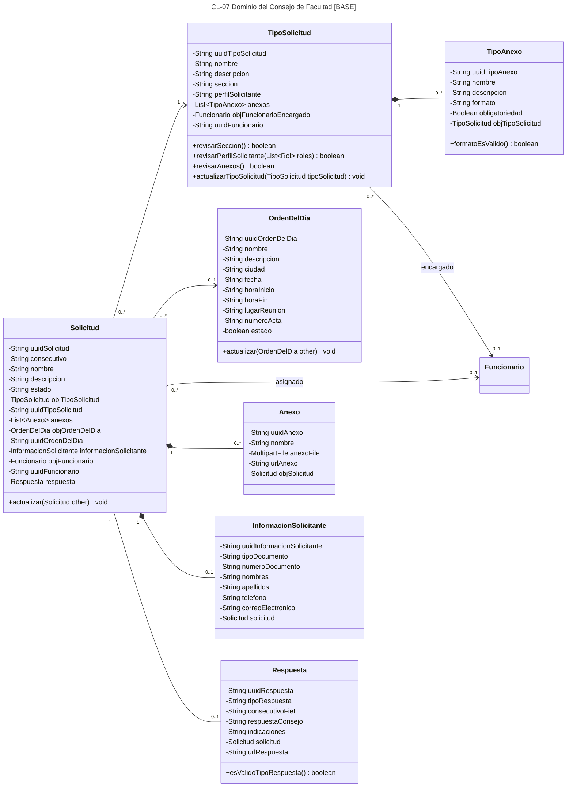
```mermaid
---
title: CL-07 Dominio del Consejo de Facultad [BASE]
---
classDiagram
    direction LR
    class Solicitud {
        -String uuidSolicitud
        -String consecutivo
        -String nombre
        -String descripcion
        -String estado
        -TipoSolicitud objTipoSolicitud
        -String uuidTipoSolicitud
        -List~Anexo~ anexos
        -OrdenDelDia objOrdenDelDia
        -String uuidOrdenDelDia
        -InformacionSolicitante informacionSolicitante
        -Funcionario objFuncionario
        -String uuidFuncionario
        -Respuesta respuesta
        +actualizar(Solicitud other) void
    }
    class TipoSolicitud {
        -String uuidTipoSolicitud
        -String nombre
        -String descripcion
        -String seccion
        -String perfilSolicitante
        -List~TipoAnexo~ anexos
        -Funcionario objFuncionarioEncargado
        -String uuidFuncionario
        +revisarSeccion() boolean
        +revisarPerfilSolicitante(List~Rol~ roles) boolean
        +revisarAnexos() boolean
        +actualizarTipoSolicitud(TipoSolicitud tipoSolicitud) void
    }
    class TipoAnexo {
        -String uuidTipoAnexo
        -String nombre
        -String descripcion
        -String formato
        -Boolean obligatoriedad
        -TipoSolicitud objTipoSolicitud
        +formatoEsValido() boolean
    }
    class Anexo {
        -String uuidAnexo
        -String nombre
        -MultipartFile anexoFile
        -String urlAnexo
        -Solicitud objSolicitud
    }
    class OrdenDelDia {
        -String uuidOrdenDelDia
        -String nombre
        -String descripcion
        -String ciudad
        -String fecha
        -String horaInicio
        -String horaFin
        -String lugarReunion
        -String numeroActa
        -boolean estado
        +actualizar(OrdenDelDia other) void
    }
    class InformacionSolicitante {
        -String uuidInformacionSolicitante
        -String tipoDocumento
        -String numeroDocumento
        -String nombres
        -String apellidos
        -String telefono
        -String correoElectronico
        -Solicitud solicitud
    }
    class Respuesta {
        -String uuidRespuesta
        -String tipoRespuesta
        -String consecutivoFiet
        -String respuestaConsejo
        -String indicaciones
        -Solicitud solicitud
        -String urlRespuesta
        +esValidoTipoRespuesta() boolean
    }
    class Funcionario {
    }
    Solicitud "0..*" --> "1" TipoSolicitud
    Solicitud "0..*" --> "0..1" OrdenDelDia
    Solicitud "0..*" --> "0..1" Funcionario : asignado
    Solicitud "1" *-- "0..*" Anexo
    Solicitud "1" *-- "0..1" InformacionSolicitante
    Solicitud "1" -- "0..1" Respuesta
    TipoSolicitud "1" *-- "0..*" TipoAnexo
    TipoSolicitud "0..*" --> "0..1" Funcionario : encargado
```

### CL-08 Patrón hexagonal en un proceso (Cancelación de Matrícula) [EXTENSIÓN]

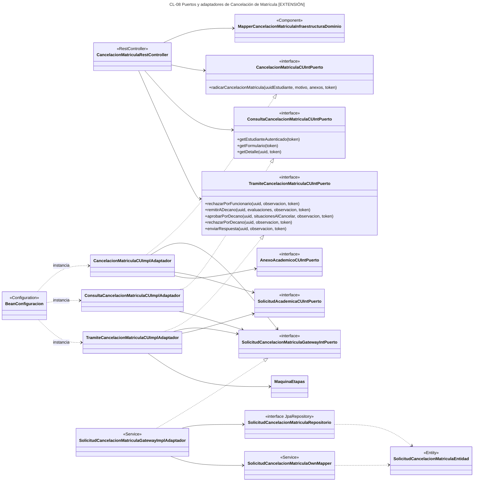
```mermaid
---
title: CL-08 Puertos y adaptadores de Cancelación de Matrícula [EXTENSIÓN]
---
classDiagram
    direction LR
    class CancelacionMatriculaRestController {
        <<RestController>>
    }
    class MapperCancelacionMatriculaInfraestructuraDominio {
        <<Component>>
    }
    class CancelacionMatriculaCUIntPuerto {
        <<interface>>
        +radicarCancelacionMatricula(uuidEstudiante, motivo, anexos, token)
    }
    class ConsultaCancelacionMatriculaCUIntPuerto {
        <<interface>>
        +getEstudianteAutenticado(token)
        +getFormulario(token)
        +getDetalle(uuid, token)
    }
    class TramiteCancelacionMatriculaCUIntPuerto {
        <<interface>>
        +rechazarPorFuncionario(uuid, observacion, token)
        +remitirADecano(uuid, evaluaciones, observacion, token)
        +aprobarPorDecano(uuid, situacionesAlCancelar, observacion, token)
        +rechazarPorDecano(uuid, observacion, token)
        +enviarRespuesta(uuid, observacion, token)
    }
    class CancelacionMatriculaCUImplAdaptador {
    }
    class ConsultaCancelacionMatriculaCUImplAdaptador {
    }
    class TramiteCancelacionMatriculaCUImplAdaptador {
    }
    class SolicitudCancelacionMatriculaGatewayIntPuerto {
        <<interface>>
    }
    class SolicitudCancelacionMatriculaGatewayImplAdaptador {
        <<Service>>
    }
    class SolicitudCancelacionMatriculaRepositorio {
        <<interface JpaRepository>>
    }
    class SolicitudCancelacionMatriculaOwnMapper {
        <<Service>>
    }
    class SolicitudCancelacionMatriculaEntidad {
        <<Entity>>
    }
    class SolicitudAcademicaCUIntPuerto {
        <<interface>>
    }
    class AnexoAcademicoCUIntPuerto {
        <<interface>>
    }
    class MaquinaEtapas {
    }
    class BeanConfiguracion {
        <<Configuration>>
    }
    CancelacionMatriculaRestController --> MapperCancelacionMatriculaInfraestructuraDominio
    CancelacionMatriculaRestController --> CancelacionMatriculaCUIntPuerto
    CancelacionMatriculaRestController --> ConsultaCancelacionMatriculaCUIntPuerto
    CancelacionMatriculaRestController --> TramiteCancelacionMatriculaCUIntPuerto
    CancelacionMatriculaCUImplAdaptador ..|> CancelacionMatriculaCUIntPuerto
    ConsultaCancelacionMatriculaCUImplAdaptador ..|> ConsultaCancelacionMatriculaCUIntPuerto
    TramiteCancelacionMatriculaCUImplAdaptador ..|> TramiteCancelacionMatriculaCUIntPuerto
    CancelacionMatriculaCUImplAdaptador --> SolicitudCancelacionMatriculaGatewayIntPuerto
    CancelacionMatriculaCUImplAdaptador --> SolicitudAcademicaCUIntPuerto
    CancelacionMatriculaCUImplAdaptador --> AnexoAcademicoCUIntPuerto
    TramiteCancelacionMatriculaCUImplAdaptador --> SolicitudCancelacionMatriculaGatewayIntPuerto
    TramiteCancelacionMatriculaCUImplAdaptador --> SolicitudAcademicaCUIntPuerto
    TramiteCancelacionMatriculaCUImplAdaptador --> MaquinaEtapas
    ConsultaCancelacionMatriculaCUImplAdaptador --> SolicitudCancelacionMatriculaGatewayIntPuerto
    SolicitudCancelacionMatriculaGatewayImplAdaptador ..|> SolicitudCancelacionMatriculaGatewayIntPuerto
    SolicitudCancelacionMatriculaGatewayImplAdaptador --> SolicitudCancelacionMatriculaRepositorio
    SolicitudCancelacionMatriculaGatewayImplAdaptador --> SolicitudCancelacionMatriculaOwnMapper
    SolicitudCancelacionMatriculaRepositorio ..> SolicitudCancelacionMatriculaEntidad
    SolicitudCancelacionMatriculaOwnMapper ..> SolicitudCancelacionMatriculaEntidad
    BeanConfiguracion ..> CancelacionMatriculaCUImplAdaptador : instancia
    BeanConfiguracion ..> ConsultaCancelacionMatriculaCUImplAdaptador : instancia
    BeanConfiguracion ..> TramiteCancelacionMatriculaCUImplAdaptador : instancia
```

### ER-01 Modelo relacional de la extensión [EXTENSIÓN]

```mermaid
---
title: ER-01 Modelo relacional de la extensión, 19 tablas [EXTENSIÓN]
---
erDiagram
    usuarios {
        varchar uuidUsuario PK
    }
    PROGRAMA_ACADEMICO {
        varchar uuidProgramaAcademico PK
        varchar nombre UK
        varchar sigla UK
        int ultimoConsecutivoAsignatura
    }
    ESTUDIANTE {
        varchar Usuario_uuid PK
        varchar codigoEstudiantil UK
        varchar ProgramaAcademico_uuid FK
        varchar semestre
        varchar facultad
    }
    FUNCIONARIO_ACADEMICO {
        varchar Usuario_uuid PK
        varchar cargo
    }
    ASIGNATURA {
        varchar uuidAsignatura PK
        varchar codigoAsignatura UK
        varchar nombreAsignatura
        varchar ProgramaAcademico_uuid FK
    }
    ASIGNATURA_MATRICULADA {
        varchar uuidAsignaturaMatriculada PK
        varchar Estudiante_uuid FK
        varchar Asignatura_uuid FK
        varchar grupo
        varchar estado
    }
    TIPO_SOLICITUD_ACADEMICA {
        varchar uuidTipoSolicitudAcademica PK
        varchar nombre
        varchar descripcion
        varchar FuncionarioAcademico_uuid FK
    }
    ETAPA_SOLICITUD_ACADEMICA {
        varchar uuidEtapa PK
        varchar codigo
        varchar TipoSolicitudAcademica_uuid FK
    }
    ETAPA_ETIQUETA_ROL {
        varchar Etapa_uuid PK
        enum rol PK
        varchar etiqueta
    }
    SOLICITUD_ACADEMICA {
        varchar uuidSolicitudAcademica PK
        varchar radicado UK
        varchar Estudiante_uuid FK
        varchar TipoSolicitudAcademica_uuid FK
        datetime fechaCreacion
        varchar Etapa_uuid FK
    }
    SOLICITUD_CANCELACION_MATRICULA {
        varchar SolicitudAcademica_uuid PK
        varchar motivoCancelacion
    }
    SOLICITUD_CANCELACION_ASIGNATURA {
        varchar SolicitudAcademica_uuid PK
        varchar motivoCancelacion
    }
    SOLICITUD_EXAMEN_SUPLETORIO {
        varchar SolicitudAcademica_uuid PK
        varchar AsignaturaMatriculada_uuid FK
        datetime fechaExamenNoPresentado
        datetime fechaAcordadaExamen
        enum tipoCausa
    }
    SOLICITUD_SUPLETORIO_CRUCE_ASIGNATURA {
        varchar SolicitudAcademica_uuid PK
        varchar AsignaturaMatriculadaCruzada_uuid FK
        datetime fechaExamenCruzada
        varchar horaExamenCruzada
    }
    SITUACION_ACADEMICA_ASIGNATURA {
        varchar uuidSituacionAcademica PK
        varchar codigo
        varchar nombre
    }
    ASIGNATURA_SOLICITUD_ACADEMICA {
        varchar uuidAsignaturaSolicitud PK
        varchar SolicitudAcademica_uuid FK
        varchar AsignaturaMatriculada_uuid FK
        varchar numeroFaltas
        varchar nota
        varchar SituacionMatricula_uuid FK
        varchar SituacionCancelar_uuid FK
        tinyint cumpleCondiciones
        varchar observacionEvaluacion
        tinyint aprobadaPorDecano
        varchar observacionDecision
    }
    TIPO_ANEXO_ACADEMICO {
        varchar uuidTipoAnexoAcademico PK
        varchar TipoSolicitudAcademica_uuid FK
        varchar nombre
        varchar formatosPermitidos
        tinyint obligatorio
    }
    ANEXO_ACADEMICO {
        varchar uuidAnexoAcademico PK
        varchar SolicitudAcademica_uuid FK
        varchar TipoAnexoAcademico_uuid FK
        varchar nombreArchivo
        varchar urlArchivo
        varchar tipoArchivo
        bigint tamanioBytes
        varchar Usuario_uuid FK
        datetime fechaSubida
    }
    RESOLUCION_ACADEMICA {
        varchar SolicitudAcademica_uuid PK
        varchar urlArchivo
        varchar nombreArchivo
        datetime fechaSubida
        varchar FuncionarioAcademico_uuid FK
    }
    HISTORIAL_SOLICITUD_ACADEMICA {
        varchar uuidHistorial PK
        varchar SolicitudAcademica_uuid FK
        varchar Usuario_uuid FK
        varchar accion
        varchar observaciones
        datetime fecha
    }
    usuarios ||--o| ESTUDIANTE : "es"
    usuarios ||--o| FUNCIONARIO_ACADEMICO : "es"
    usuarios ||--o{ ANEXO_ACADEMICO : "sube"
    usuarios ||--o{ HISTORIAL_SOLICITUD_ACADEMICA : "actua"
    PROGRAMA_ACADEMICO ||--o{ ESTUDIANTE : "agrupa"
    PROGRAMA_ACADEMICO ||--o{ ASIGNATURA : "agrupa"
    ESTUDIANTE ||--o{ ASIGNATURA_MATRICULADA : "matricula"
    ASIGNATURA ||--o{ ASIGNATURA_MATRICULADA : "se cursa en"
    FUNCIONARIO_ACADEMICO ||--o{ TIPO_SOLICITUD_ACADEMICA : "atiende"
    FUNCIONARIO_ACADEMICO ||--o{ RESOLUCION_ACADEMICA : "sube"
    TIPO_SOLICITUD_ACADEMICA |o--o{ ETAPA_SOLICITUD_ACADEMICA : "define"
    TIPO_SOLICITUD_ACADEMICA ||--o{ TIPO_ANEXO_ACADEMICO : "exige"
    TIPO_SOLICITUD_ACADEMICA ||--o{ SOLICITUD_ACADEMICA : "clasifica"
    ETAPA_SOLICITUD_ACADEMICA ||--o{ ETAPA_ETIQUETA_ROL : "etiqueta"
    ETAPA_SOLICITUD_ACADEMICA ||--o{ SOLICITUD_ACADEMICA : "etapa actual"
    ESTUDIANTE ||--o{ SOLICITUD_ACADEMICA : "radica"
    SOLICITUD_ACADEMICA ||--o| SOLICITUD_CANCELACION_MATRICULA : "especializa"
    SOLICITUD_ACADEMICA ||--o| SOLICITUD_CANCELACION_ASIGNATURA : "especializa"
    SOLICITUD_ACADEMICA ||--o| SOLICITUD_EXAMEN_SUPLETORIO : "especializa"
    SOLICITUD_ACADEMICA ||--o| RESOLUCION_ACADEMICA : "tiene"
    SOLICITUD_ACADEMICA ||--o{ ASIGNATURA_SOLICITUD_ACADEMICA : "evalua"
    SOLICITUD_ACADEMICA ||--o{ ANEXO_ACADEMICO : "adjunta"
    SOLICITUD_ACADEMICA ||--o{ HISTORIAL_SOLICITUD_ACADEMICA : "registra"
    SOLICITUD_EXAMEN_SUPLETORIO ||--o| SOLICITUD_SUPLETORIO_CRUCE_ASIGNATURA : "cruce"
    ASIGNATURA_MATRICULADA ||--o{ SOLICITUD_EXAMEN_SUPLETORIO : "no presentada"
    ASIGNATURA_MATRICULADA ||--o{ SOLICITUD_SUPLETORIO_CRUCE_ASIGNATURA : "cruzada"
    ASIGNATURA_MATRICULADA ||--o{ ASIGNATURA_SOLICITUD_ACADEMICA : "evaluada"
    SITUACION_ACADEMICA_ASIGNATURA ||--o{ ASIGNATURA_SOLICITUD_ACADEMICA : "situacion de matricula o al cancelar"
    TIPO_ANEXO_ACADEMICO |o--o{ ANEXO_ACADEMICO : "tipifica"
```

---

## 3. Paquetes, componentes (C4) y despliegue

### PK-01 Paquetes y dirección de dependencias del backend

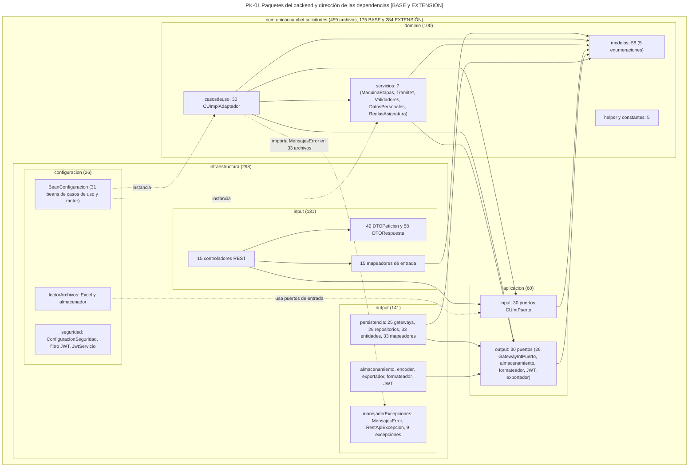
```mermaid
---
title: PK-01 Paquetes del backend y dirección de las dependencias [BASE y EXTENSIÓN]
---
flowchart TB
    subgraph RAIZ["com.unicauca.cfiet.solicitudes (459 archivos, 175 BASE y 284 EXTENSIÓN)"]
        subgraph APL["aplicacion (60)"]
            API["input: 30 puertos CUIntPuerto"]
            APO["output: 30 puertos (26 GatewayIntPuerto, almacenamiento, formateador, JWT, exportador)"]
        end
        subgraph DOM["dominio (100)"]
            DCU["casosdeuso: 30 CUImplAdaptador"]
            DSE["servicios: 7 (MaquinaEtapas, Tramite*, Validadores, DatosPersonales, ReglasAsignatura)"]
            DMO["modelos: 58 (5 enumeraciones)"]
            DHE["helper y constantes: 5"]
        end
        subgraph INF["infraestructura (298)"]
            subgraph INP["input (131)"]
                INC["15 controladores REST"]
                IND["42 DTOPeticion y 58 DTORespuesta"]
                INM["15 mapeadores de entrada"]
            end
            subgraph OUT["output (141)"]
                OPG["persistencia: 25 gateways, 29 repositorios, 33 entidades, 33 mapeadores"]
                OEX["manejadorExcepciones: MensajesError, RestApiExcepcion, 9 excepciones"]
                OOT["almacenamiento, encoder, exportador, formateador, JWT"]
            end
            subgraph CFG["configuracion (26)"]
                CBE["BeanConfiguracion (31 beans de casos de uso y motor)"]
                CSE["seguridad: ConfiguracionSeguridad, filtro JWT, JwtServicio"]
                CLA["lectorArchivos: Excel y almacenador"]
            end
        end
    end
    INC --> API
    INC --> IND
    INC --> INM
    INM --> DMO
    DCU --> API
    DCU --> APO
    DCU --> DMO
    DCU --> DSE
    DSE --> APO
    DSE --> DMO
    API --> DMO
    APO --> DMO
    OPG --> APO
    OPG --> DMO
    OOT --> APO
    CBE -.->|instancia| DCU
    CBE -.->|instancia| DSE
    CLA -.->|usa puertos de entrada| API
    DCU -.->|importa MensajesError en 33 archivos| OEX
```

### C4-01 Contexto del sistema

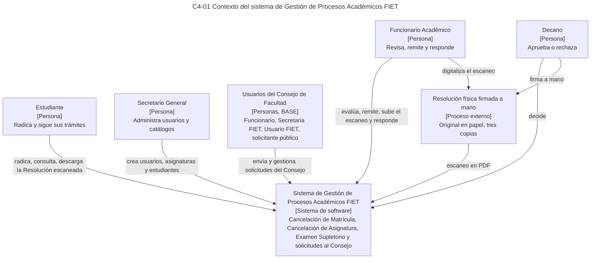
```mermaid
---
title: C4-01 Contexto del sistema de Gestión de Procesos Académicos FIET
---
flowchart TB
    EST["Estudiante<br/>[Persona]<br/>Radica y sigue sus trámites"]
    FUN["Funcionario Académico<br/>[Persona]<br/>Revisa, remite y responde"]
    DEC["Decano<br/>[Persona]<br/>Aprueba o rechaza"]
    SGE["Secretario General<br/>[Persona]<br/>Administra usuarios y catálogos"]
    CON["Usuarios del Consejo de Facultad<br/>[Personas, BASE]<br/>Funcionario, Secretaria FIET, Usuario FIET, solicitante público"]
    SIS["Sistema de Gestión de Procesos Académicos FIET<br/>[Sistema de software]<br/>Cancelación de Matrícula, Cancelación de Asignatura, Examen Supletorio y solicitudes al Consejo"]
    FIS["Resolución física firmada a mano<br/>[Proceso externo]<br/>Original en papel, tres copias"]
    EST -->|radica, consulta, descarga la Resolución escaneada| SIS
    FUN -->|evalúa, remite, sube el escaneo y responde| SIS
    DEC -->|decide| SIS
    SGE -->|crea usuarios, asignaturas y estudiantes| SIS
    CON -->|envía y gestiona solicitudes del Consejo| SIS
    DEC -->|firma a mano| FIS
    FUN -->|digitaliza el escaneo| FIS
    FIS -->|escaneo en PDF| SIS
```

### C4-02 Contenedores

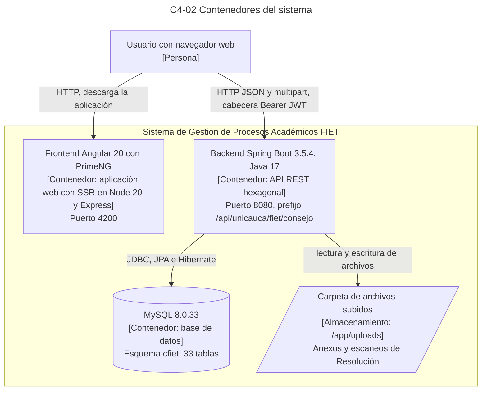
```mermaid
---
title: C4-02 Contenedores del sistema
---
flowchart TB
    USR["Usuario con navegador web<br/>[Persona]"]
    subgraph SIS["Sistema de Gestión de Procesos Académicos FIET"]
        FRO["Frontend Angular 20 con PrimeNG<br/>[Contenedor: aplicación web con SSR en Node 20 y Express]<br/>Puerto 4200"]
        BAC["Backend Spring Boot 3.5.4, Java 17<br/>[Contenedor: API REST hexagonal]<br/>Puerto 8080, prefijo /api/unicauca/fiet/consejo"]
        DB[("MySQL 8.0.33<br/>[Contenedor: base de datos]<br/>Esquema cfiet, 33 tablas")]
        FS[/"Carpeta de archivos subidos<br/>[Almacenamiento: /app/uploads]<br/>Anexos y escaneos de Resolución"/]
    end
    USR -->|HTTP, descarga la aplicación| FRO
    USR -->|HTTP JSON y multipart, cabecera Bearer JWT| BAC
    BAC -->|JDBC, JPA e Hibernate| DB
    BAC -->|lectura y escritura de archivos| FS
```

### C4-03 Componentes del backend por capa

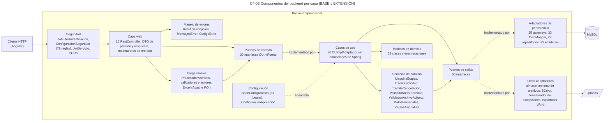
```mermaid
---
title: C4-03 Componentes del backend por capa [BASE y EXTENSIÓN]
---
flowchart LR
    CLI["Cliente HTTP<br/>(Angular)"]
    subgraph BAC["Backend Spring Boot"]
        SEC["Seguridad<br/>JwtFiltroAutenticacion, ConfiguracionSeguridad (78 reglas), JwtServicio, CORS"]
        WEB["Capa web<br/>15 RestController, DTO de petición y respuesta, mapeadores de entrada"]
        PIN["Puertos de entrada<br/>30 interfaces CUIntPuerto"]
        CAS["Casos de uso<br/>30 CUImplAdaptador sin anotaciones de Spring"]
        DSV["Servicios de dominio<br/>MaquinaEtapas, TramiteSolicitud, TramiteCancelacion, ValidadorActorSolicitud, ValidadorArchivoAdjunto, DatosPersonales, ReglasAsignatura"]
        MOD["Modelos de dominio<br/>58 clases y enumeraciones"]
        POU["Puertos de salida<br/>30 interfaces"]
        PER["Adaptadores de persistencia<br/>25 gateways, 33 OwnMapper, 29 repositorios, 33 entidades"]
        ADP["Otros adaptadores<br/>almacenamiento de archivos, BCrypt, formateador de excepciones, exportador Word"]
        EXC["Manejo de errores<br/>RestApiExcepcion, MensajesError, CodigoError"]
        XLS["Carga masiva<br/>ProcesadorArchivos, validadores y lectores Excel (Apache POI)"]
        CFG["Configuración<br/>BeanConfiguracion (31 beans), ConfiguracionAplicacion"]
    end
    DB[("MySQL")]
    FS[/"uploads"/]
    CLI --> SEC
    SEC --> WEB
    WEB --> PIN
    WEB --> XLS
    PIN -.->|implementado por| CAS
    CAS --> DSV
    CAS --> MOD
    CAS --> POU
    DSV --> POU
    POU -.->|implementado por| PER
    POU -.->|implementado por| ADP
    PER --> DB
    ADP --> FS
    WEB --> EXC
    CFG -.->|ensambla| CAS
    XLS --> PIN
```

### C4-04 Componentes de la extensión por módulo

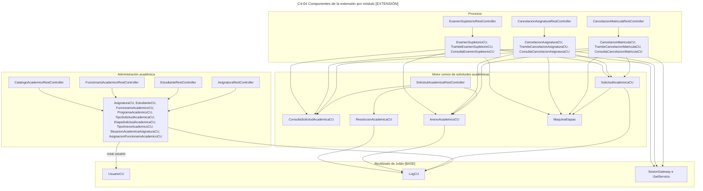
```mermaid
---
title: C4-04 Componentes de la extensión por módulo [EXTENSIÓN]
---
flowchart TB
    subgraph ADM["Administración académica"]
        CAS1["AsignaturaRestController"]
        CES1["EstudianteRestController"]
        CFA1["FuncionarioAcademicoRestController"]
        CCA1["CatalogoAcademicoRestController"]
        UAS["AsignaturaCU, EstudianteCU, FuncionarioAcademicoCU, ProgramaAcademicoCU, TipoSolicitudAcademicaCU, EtapaSolicitudAcademicaCU, TipoAnexoAcademicoCU, SituacionAcademicaAsignaturaCU, AsignacionFuncionarioAcademicoCU"]
    end
    subgraph MOT["Motor común de solicitudes académicas"]
        CSA["SolicitudAcademicaRestController"]
        CONS["ConsultaSolicitudAcademicaCU"]
        SOL["SolicitudAcademicaCU"]
        ANX["AnexoAcademicoCU"]
        RES["ResolucionAcademicaCU"]
        MAQ["MaquinaEtapas"]
    end
    subgraph PRO["Procesos"]
        CCM["CancelacionMatriculaRestController"]
        CCA2["CancelacionAsignaturaRestController"]
        CES2["ExamenSupletorioRestController"]
        CMU["CancelacionMatriculaCU, TramiteCancelacionMatriculaCU, ConsultaCancelacionMatriculaCU"]
        CAU["CancelacionAsignaturaCU, TramiteCancelacionAsignaturaCU, ConsultaCancelacionAsignaturaCU"]
        ESU["ExamenSupletorioCU, TramiteExamenSupletorioCU, ConsultaExamenSupletorioCU"]
    end
    subgraph BAS["Reutilizado de Julián [BASE]"]
        USU["UsuarioCU"]
        LOG["LogCU"]
        SES["SesionGateway e IJwtServicio"]
    end
    CAS1 --> UAS
    CES1 --> UAS
    CFA1 --> UAS
    CCA1 --> UAS
    UAS -->|crear usuario| USU
    UAS --> LOG
    CSA --> CONS
    CSA --> ANX
    CSA --> RES
    CCM --> CMU
    CCA2 --> CAU
    CES2 --> ESU
    CMU --> SOL
    CAU --> SOL
    ESU --> SOL
    CMU --> ANX
    CAU --> ANX
    ESU --> ANX
    CMU --> CONS
    CAU --> CONS
    ESU --> CONS
    SOL --> MAQ
    CMU --> MAQ
    CAU --> MAQ
    ESU --> MAQ
    CMU --> SES
    CAU --> SES
    ESU --> SES
    SOL --> LOG
    ANX --> LOG
    RES --> LOG
```

### C4-05 Componentes del frontend

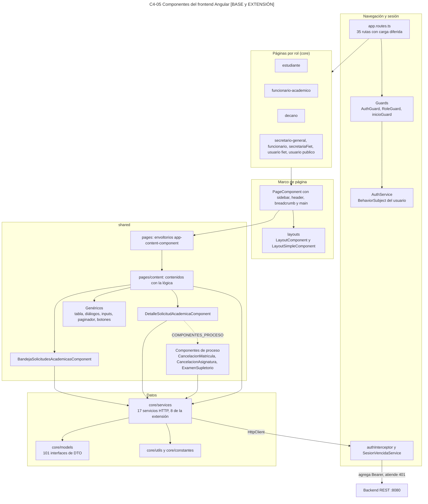
```mermaid
---
title: C4-05 Componentes del frontend Angular [BASE y EXTENSIÓN]
---
flowchart TB
    subgraph NAV["Navegación y sesión"]
        RUT["app.routes.ts<br/>35 rutas con carga diferida"]
        GUA["Guards<br/>AuthGuard, RoleGuard, inicioGuard"]
        INT["authInterceptor y SesionVencidaService"]
        AUT["AuthService<br/>BehaviorSubject del usuario"]
    end
    subgraph LAY["Marco de página"]
        LCO["layouts<br/>LayoutComponent y LayoutSimpleComponent"]
        PAG["PageComponent con sidebar, header, breadcrumb y main"]
    end
    subgraph ROL["Páginas por rol (core)"]
        PES["estudiante"]
        PFA["funcionario-academico"]
        PDE["decano"]
        PSG["secretario-general, funcionario, secretariaFiet, usuario fiet, usuario publico"]
    end
    subgraph SHA["shared"]
        ENV["pages: envoltorios app-content-component"]
        CON["pages/content: contenidos con la lógica"]
        BAN["BandejaSolicitudesAcademicasComponent"]
        DET["DetalleSolicitudAcademicaComponent"]
        PRC["Componentes de proceso<br/>CancelacionMatricula, CancelacionAsignatura, ExamenSupletorio"]
        GEN["Genéricos<br/>tabla, diálogos, inputs, paginador, botones"]
    end
    subgraph DAT["Datos"]
        SRV["core/services<br/>17 servicios HTTP, 8 de la extensión"]
        MOD["core/models<br/>101 interfaces de DTO"]
        UTI["core/utils y core/constantes"]
    end
    API["Backend REST :8080"]
    RUT --> GUA
    RUT --> ROL
    GUA --> AUT
    ROL --> PAG
    PAG --> LCO
    PAG --> ENV
    ENV --> CON
    CON --> BAN
    CON --> DET
    DET -.->|COMPONENTES_PROCESO| PRC
    CON --> GEN
    BAN --> SRV
    DET --> SRV
    PRC --> SRV
    CON --> SRV
    SRV --> MOD
    SRV --> UTI
    INT -->|agrega Bearer, atiende 401| API
    SRV -->|HttpClient| INT
```

### DP-01 Despliegue con Docker Compose

```mermaid
---
title: DP-01 Despliegue local con Docker Compose y frontend aparte
---
flowchart TB
    NAV["Navegador del usuario"]
    subgraph HOST["Equipo de desarrollo con Docker Desktop"]
        subgraph FEH["Frontend, fuera del compose"]
            FEN["npm start (ng serve) en el puerto 4200<br/>o imagen frontend: node:20-alpine, EXPOSE 4200, node dist/front-fiet-sc/server/server.mjs"]
        end
        subgraph COM["backend/docker-compose.yml, red por defecto de Compose"]
            subgraph C1["Contenedor solicitudes-consejo-de-facultad"]
                BAK["eclipse-temurin:17-jdk-jammy<br/>java -jar app_cfiet.jar<br/>mem_limit 512m, restart always<br/>SERVER_PORT 8080, DB_URL, DB_USER_NAME, DB_PASSWORD, UPLOADS_PATH /app/uploads"]
            end
            subgraph C2["Contenedor cfiet_database"]
                MYS["mysql:8.0.33<br/>healthcheck mysqladmin ping<br/>restart always<br/>volumen anónimo de datos"]
            end
        end
        UPL[/"Directorio backend/uploads (bind mount)"/]
        PUE["Puerto 3307 del equipo publicado hacia el 3306 del contenedor"]
    end
    NAV -->|http localhost 4200| FEN
    NAV -->|http localhost 8080 api| BAK
    BAK -->|jdbc mysql cfiet_database 3306 base cfiet| MYS
    BAK ---|monta ./uploads en /app/uploads| UPL
    PUE -.->|publica| MYS
    BAK -.->|depends_on service_healthy| MYS
```

---

## 4. Diagramas de secuencia

### SQ-01 Inicio de sesión y primera petición autenticada [BASE]

```mermaid
---
title: SQ-01 Inicio de sesión y primera petición autenticada [BASE]
---
sequenceDiagram
    autonumber
    actor U as Usuario
    participant LF as LoginFormComponent
    participant AS as AuthService
    participant IN as authInterceptor
    participant JF as JwtFiltroAutenticacion
    participant SC as SesionRestController
    participant CU as SesionCUImplAdaptador
    participant GW as SesionGatewayImplAdaptador
    participant AM as AuthenticationManager
    participant JS as JwtServicio
    participant LG as LogCUImplAdaptador
    participant UC as UsuarioRestController
    participant DB as MySQL
    U->>LF: usuario y contraseña
    LF->>AS: login(credenciales)
    AS->>IN: POST /sesiones
    IN->>JF: petición sin token
    JF->>SC: ruta pública, continúa
    SC->>CU: login(username, password)
    CU->>GW: login(username, password)
    GW->>DB: findByUsername
    alt el usuario no existe
        GW-->>CU: null
        CU-->>SC: error 5 credenciales erróneas
        SC-->>AS: HTTP 500 con codigoError
    else el usuario existe
        GW->>AM: authenticate(username, password)
        AM->>DB: carga usuario y compara BCrypt
        AM-->>GW: autenticado
        GW->>JS: getToken(usuario)
        JS-->>GW: JWT HS256 con vigencia de 24 horas
        GW-->>CU: token
        CU->>CU: valida usuario activo y roles habilitados (error 8 si no)
        CU->>LG: crearLogSesion(Inicio de sesión)
        LG->>DB: insert en logs
        CU-->>SC: UsuarioTokenizado
        SC-->>AS: uuidUsuario y token
    end
    AS->>AS: guarda authToken y currentUser en localStorage
    AS->>IN: GET /usuarios/uuid
    IN->>JF: cabecera Authorization Bearer
    JF->>JS: extrae el subject y valida firma y expiración
    JF->>DB: carga usuario y roles actuales
    JF->>UC: SecurityContext con las authorities
    UC-->>AS: usuario con roles
    AS-->>LF: usuario emitido en usuario$
    LF->>LF: rutaDeInicio(roles) y navega
```

### SQ-02 Radicar una Cancelación de Matrícula [EXTENSIÓN]

```mermaid
---
title: SQ-02 Radicar una Cancelación de Matrícula [EXTENSIÓN]
---
sequenceDiagram
    autonumber
    actor E as Estudiante
    participant FE as CancelacionMatriculaService
    participant CT as CancelacionMatriculaRestController
    participant CQ as ConsultaCancelacionMatriculaCU
    participant CM as CancelacionMatriculaCU
    participant SO as SolicitudAcademicaCU
    participant MQ as MaquinaEtapas
    participant AN as AnexoAcademicoCU
    participant AL as AlmacenamientoAnexos
    participant GW as Gateways de persistencia
    participant LG as LogCU
    participant DB as MySQL
    E->>FE: abre el formulario
    FE->>CT: GET /cancelaciones-matricula/formulario
    CT->>CQ: getFormulario(token)
    CQ->>GW: tipos de anexo del proceso y matrículas activas
    CQ-->>FE: codigoEstudiantil, anexos y asignaturas activas
    E->>FE: motivo y un archivo por cada anexo obligatorio
    FE->>CT: POST /cancelaciones-matricula multipart
    Note over CT,DB: El controlador abre la transacción y todo se confirma o se revierte junto
    CT->>CQ: getEstudianteAutenticado(token)
    CT->>CM: radicarCancelacionMatricula(uuidEstudiante, motivo, anexos, token)
    CM->>GW: valida rol Estudiante y fila en ESTUDIANTE
    CM->>CM: exige al menos una matrícula activa
    CM->>CM: motivo obligatorio y de máximo 255 caracteres
    CM->>GW: tipo Cancelación de Matrícula existe
    CM->>GW: tipos de anexo (6 obligatorios)
    CM->>CM: valida anexos obligatorios, pertenencia, formato, tamaño y firma del archivo
    CM->>SO: crearSolicitud(uuidEstudiante, uuidTipo, token)
    SO->>SO: verificarSinSolicitudEnCurso
    SO->>MQ: siguienteEtapa(proceso, nueva, RADICAR, ESTUDIANTE)
    MQ-->>SO: RADICADA
    SO->>GW: etapa RADICADA y siguiente radicado AAAA-CM-0001
    SO->>GW: crear(solicitud, historial RADICAR)
    GW->>DB: SOLICITUD_ACADEMICA e HISTORIAL_SOLICITUD_ACADEMICA
    SO->>LG: crearLog(Radicar solicitud académica)
    CM->>GW: guardar(SOLICITUD_CANCELACION_MATRICULA con una fila por matrícula activa)
    GW->>DB: SOLICITUD_CANCELACION_MATRICULA y ASIGNATURA_SOLICITUD_ACADEMICA
    loop por cada anexo
        CM->>AN: adjuntarAnexo(uuidSolicitud, uuidTipo, archivo, actor, token)
        AN->>AL: guardar(archivo)
        AL->>AL: escribe en uploads y registra borrado si hay rollback
        AN->>GW: guardar ficha ANEXO_ACADEMICO
        AN->>LG: crearLog(Adjuntar anexo académico)
    end
    CM->>LG: crearLog(Radicar cancelación de matrícula)
    CM-->>CT: solicitud radicada
    CT-->>FE: RadicacionCancelacionMatriculaDTORespuesta con el radicado
    FE-->>E: pantalla de éxito con el radicado
```

### SQ-03 Radicar un Examen Supletorio con validación de plazo [EXTENSIÓN]

```mermaid
---
title: SQ-03 Radicar un Examen Supletorio con validación de plazo [EXTENSIÓN]
---
sequenceDiagram
    autonumber
    actor E as Estudiante
    participant FE as ExamenSupletorioService
    participant CT as ExamenSupletorioRestController
    participant ES as ExamenSupletorioCU
    participant CK as Clock America Bogota
    participant SO as SolicitudAcademicaCU
    participant AN as AnexoAcademicoCU
    participant GW as Gateways de persistencia
    participant LG as LogCU
    participant DB as MySQL
    E->>FE: asignatura, fecha, causa y anexos
    FE->>CT: POST /examenes-supletorios multipart
    CT->>ES: radicarExamenSupletorio(uuidEstudiante, uuidMatricula, fecha, causa, cruce, anexos, token)
    ES->>GW: valida rol Estudiante y tipo Examen Supletorio
    ES->>SO: verificarSinSolicitudEnCurso(uuidEstudiante, tipo)
    ES->>ES: asignatura obligatoria, propia y activa
    ES->>ES: causa cruce u otra
    ES->>CK: fecha actual
    CK-->>ES: hoy
    ES->>ES: fecha no futura y máximo 3 días hábiles de lunes a viernes desde el examen
    alt la causa es cruce
        ES->>ES: asignatura cruzada distinta, activa y propia
        ES->>ES: fecha y hora HH:mm del examen cruzado obligatorias
    else la causa es otra
        ES->>ES: rechaza datos de cruce
    end
    ES->>GW: tipos de anexo del proceso
    ES->>ES: valida anexos por causa, sin recibo ni comprobante, sin repetidos
    ES->>SO: crearSolicitud(uuidEstudiante, uuidTipo, token)
    SO->>GW: crear(solicitud RADICADA, historial RADICAR)
    GW->>DB: SOLICITUD_ACADEMICA e HISTORIAL_SOLICITUD_ACADEMICA
    ES->>GW: guardar SOLICITUD_EXAMEN_SUPLETORIO y, si hay cruce, su fila de cruce
    GW->>DB: inserta las filas del supletorio
    loop por cada anexo
        ES->>AN: adjuntarAnexo(...)
    end
    ES->>LG: crearLog(Radicar examen supletorio)
    ES-->>CT: solicitud radicada
    CT-->>FE: RadicacionExamenSupletorioDTORespuesta
```

### SQ-04 El Funcionario Académico remite una Cancelación de Matrícula al Decano [EXTENSIÓN]

```mermaid
---
title: SQ-04 El Funcionario remite una Cancelación de Matrícula al Decano [EXTENSIÓN]
---
sequenceDiagram
    autonumber
    actor F as Funcionario Académico
    participant FE as DetalleSolicitud y CancelacionMatriculaProceso
    participant CT as CancelacionMatriculaRestController
    participant TR as TramiteCancelacionMatriculaCU
    participant TC as TramiteCancelacion
    participant MQ as MaquinaEtapas
    participant SO as SolicitudAcademicaCU
    participant AL as AlmacenamientoAnexos
    participant GW as Gateways de persistencia
    participant LG as LogCU
    participant CQ as ConsultaCancelacionMatriculaCU
    F->>FE: completa faltas, nota y situaciones por asignatura
    FE->>CT: GET /catalogos-academicos/situaciones antes de abrir el diálogo
    FE->>CT: POST /cancelaciones-matricula/uuid/funcionario/remitir
    CT->>TR: remitirADecano(uuid, evaluaciones, observacion, token)
    TR->>TC: actorDe(token, FUNCIONARIO)
    TC->>GW: usuario por username del token y rol Funcionario Académico
    TR->>GW: cancelacionDe(uuid)
    TR->>TC: solicitudValidada(CANCELACION_MATRICULA, uuid, REMITIR_DECANO, actor)
    TC->>GW: solicitud por uuid
    TC->>TC: ValidadorActorSolicitud.validar (rol real y tipo asignado al Funcionario)
    TC->>MQ: siguienteEtapa(proceso, RADICADA, REMITIR_DECANO, FUNCIONARIO)
    MQ-->>TC: EN_REVISION_DECANO
    TR->>TC: cobertura(una evaluación por asignatura, sin ajenas ni repetidas)
    loop por cada asignatura
        TR->>TC: faltasDe, notaDe y situaciones del catálogo
    end
    TR->>SO: cambiarEtapa(uuid, REMITIR_DECANO, actor, observacion, token)
    SO->>MQ: transicionar(proceso, RADICADA, REMITIR_DECANO, FUNCIONARIO, entrega)
    SO->>GW: actualizarEtapa(solicitud, historial)
    opt existía un escaneo de Resolución
        SO->>GW: eliminarPorSolicitud
        SO->>AL: eliminarTrasConfirmar(archivo)
    end
    SO->>LG: crearLog(Cambiar etapa de solicitud académica)
    TR->>TC: guardarAsignaturas(asignaturas evaluadas)
    TC->>GW: ASIGNATURA_SOLICITUD_ACADEMICA
    TR->>LG: crearLog(Evaluar asignaturas de cancelación de matrícula)
    CT->>CQ: getDetalle(uuid, token)
    CQ-->>CT: detalle actualizado
    CT-->>FE: CancelacionMatriculaDetalleDTORespuesta
    FE->>FE: recargar() y toast de éxito
```

### SQ-05 El Decano aprueba parcialmente una Cancelación de Asignatura [EXTENSIÓN]

```mermaid
---
title: SQ-05 El Decano aprueba parcialmente una Cancelación de Asignatura [EXTENSIÓN]
---
sequenceDiagram
    autonumber
    actor D as Decano
    participant FE as CancelacionAsignaturaProceso
    participant CT as CancelacionAsignaturaRestController
    participant TR as TramiteCancelacionAsignaturaCU
    participant TC as TramiteCancelacion
    participant SO as SolicitudAcademicaCU
    participant MQ as MaquinaEtapas
    participant GW as Gateways de persistencia
    participant LG as LogCU
    D->>FE: marca cada asignatura como aprobada o rechazada
    alt no cambia nada
        FE->>CT: POST decano/aprobar con aceptarEvaluacion verdadero
    else cambia alguna decisión
        FE->>CT: POST decano/aprobar con decisiones por asignatura
    end
    CT->>TR: aprobarPorDecano(uuid, aceptarEvaluacion, decisiones, observacion, token)
    TR->>TC: actorDe(token, DECANO)
    TR->>GW: cancelacionDe(uuid)
    TR->>TC: solicitudValidada(CANCELACION_ASIGNATURA, uuid, APROBAR_DECANO, actor)
    TC->>MQ: siguienteEtapa(proceso, EN_REVISION_DECANO, APROBAR_DECANO, DECANO)
    MQ-->>TC: APROBADA_POR_DECANO
    TR->>TR: exige exactamente una forma (aceptarEvaluacion o decisiones)
    loop por cada asignatura
        alt acepta la evaluación
            TR->>TR: aprobada igual a cumpleCondiciones
        else decide por asignatura
            TR->>TC: cobertura y aprobada obligatoria en cada una
        end
        opt la asignatura queda rechazada
            TR->>TR: limpia la situación al cancelar
        end
    end
    TR->>TR: exige al menos una asignatura aprobada
    TR->>SO: cambiarEtapa(uuid, APROBAR_DECANO, actor, observacion, token)
    SO->>MQ: transicionar(...)
    SO->>GW: actualizarEtapa(solicitud, historial)
    SO->>LG: crearLog(Cambiar etapa de solicitud académica)
    TR->>TC: guardarAsignaturas(con aprobadaPorDecano)
    TC->>GW: ASIGNATURA_SOLICITUD_ACADEMICA
    TR->>LG: crearLog(Registrar decisión del Decano por asignatura)
    TR-->>CT: cancelación actualizada
    CT-->>FE: CancelacionAsignaturaDetalleDTORespuesta
```

### SQ-06 Enviar la respuesta con el escaneo de la Resolución y descargarla [EXTENSIÓN]

```mermaid
---
title: SQ-06 Enviar la respuesta con el escaneo de la Resolución [EXTENSIÓN]
---
sequenceDiagram
    autonumber
    actor F as Funcionario Académico
    actor E as Estudiante
    participant FE as Frontend
    participant SA as SolicitudAcademicaRestController
    participant CS as ConsultaSolicitudAcademicaCU
    participant RE as ResolucionAcademicaCU
    participant AL as AlmacenamientoAnexos
    participant CT as CancelacionMatriculaRestController
    participant TR as TramiteCancelacionMatriculaCU
    participant SO as SolicitudAcademicaCU
    participant MQ as MaquinaEtapas
    participant TC as TramiteCancelacion
    participant GW as Gateways de persistencia
    participant LG as LogCU
    F->>FE: adjunta el PDF firmado a mano y escaneado
    FE->>SA: POST /solicitudes-academicas/uuid/resolucion multipart
    SA->>CS: resolverActor(uuid, token)
    CS-->>SA: ActorSolicitud
    SA->>RE: adjuntarResolucion(uuid, archivo, actor, token)
    RE->>RE: valida proceso no supletorio, actor Funcionario, etapa permitida y PDF con firma coherente
    RE->>AL: guardar(archivo)
    RE->>GW: guardar fila RESOLUCION_ACADEMICA
    opt reemplaza un escaneo anterior
        RE->>AL: eliminarTrasConfirmar(anterior)
    end
    RE->>LG: crearLog(Adjuntar Resolución académica)
    FE->>CT: POST /cancelaciones-matricula/uuid/funcionario/responder
    CT->>TR: enviarRespuesta(uuid, observacion, token)
    TR->>SO: cambiarEtapa(uuid, ENVIAR_RESPUESTA, actor, observacion, token)
    SO->>GW: evidencias (existe la Resolución)
    SO->>MQ: transicionar(proceso, APROBADA_POR_DECANO, ENVIAR_RESPUESTA, FUNCIONARIO, entrega)
    MQ-->>SO: APROBADA exige el escaneo
    SO->>GW: actualizarEtapa(solicitud, historial)
    opt la etapa de llegada es APROBADA
        TR->>TC: cancelarActivas(asignaturas de la solicitud)
        TC->>GW: ASIGNATURA_MATRICULADA a estado cancelada
    end
    TR->>LG: crearLog de la transición
    CT-->>FE: detalle actualizado
    E->>FE: abre el detalle de la solicitud finalizada
    FE->>SA: GET /solicitudes-academicas/uuid/resolucion
    SA->>RE: obtenerResolucion(uuid, actor)
    RE->>RE: el Estudiante solo la obtiene si la etapa es final
    RE-->>E: PDF de la Resolución escaneada
```

### SQ-07 Pago del Examen Supletorio: recibo, comprobante y verificación [EXTENSIÓN]

```mermaid
---
title: SQ-07 Pago del Examen Supletorio, recibo, comprobante y verificación [EXTENSIÓN]
---
sequenceDiagram
    autonumber
    actor F as Funcionario Académico
    actor E as Estudiante
    participant FE as Frontend
    participant SA as SolicitudAcademicaRestController
    participant AN as AnexoAcademicoCU
    participant ES as ExamenSupletorioRestController
    participant TR as TramiteExamenSupletorioCU
    participant SO as SolicitudAcademicaCU
    participant MQ as MaquinaEtapas
    participant GW as Gateways de persistencia
    participant LG as LogCU
    Note over F,LG: La solicitud ya está en APROBADA_POR_DECANO
    F->>FE: adjunta el recibo de pago en PDF
    FE->>SA: POST /solicitudes-academicas/uuid/anexos con el tipo Recibo de pago
    SA->>AN: adjuntarAnexo(...)
    AN->>AN: solo Funcionario y solo en APROBADA_POR_DECANO
    FE->>ES: POST /examenes-supletorios/uuid/funcionario/recibo
    ES->>TR: enviarRecibo(uuid, token)
    TR->>SO: cambiarEtapa(uuid, ENVIAR_RECIBO, actor, null, token)
    SO->>MQ: transicionar exige el anexo Recibo de pago
    SO->>GW: actualizarEtapa a PENDIENTE_PAGO
    Note over E,LG: El Estudiante ve el estado pendiente de pago
    E->>FE: adjunta el comprobante de pago
    FE->>SA: POST /solicitudes-academicas/uuid/anexos con el tipo Comprobante de pago
    SA->>AN: adjuntarAnexo(...)
    AN->>AN: solo Estudiante y solo en PENDIENTE_PAGO
    FE->>ES: POST /examenes-supletorios/uuid/estudiante/comprobante
    ES->>TR: subirComprobante(uuid, token)
    TR->>SO: cambiarEtapa(uuid, SUBIR_COMPROBANTE, actor, null, token)
    SO->>GW: actualizarEtapa a EN_VERIFICACION_PAGO
    alt el Funcionario aprueba el comprobante
        F->>FE: indica fecha acordada opcional
        FE->>ES: POST funcionario/comprobante/aprobar
        ES->>TR: aprobarComprobante(uuid, fechaAcordadaExamen, token)
        TR->>TR: la fecha acordada no puede ser anterior al examen no presentado
        TR->>SO: cambiarEtapa(uuid, APROBAR_COMPROBANTE, actor, null, token)
        SO->>GW: actualizarEtapa a APROBADA
        opt llegó fecha acordada
            TR->>GW: actualizarFechaAcordada
            TR->>LG: crearLog(Acordar fecha de examen supletorio)
        end
    else el Funcionario rechaza el comprobante
        F->>FE: escribe la observación obligatoria
        FE->>ES: POST funcionario/comprobante/rechazar
        ES->>TR: rechazarComprobante(uuid, observacion, token)
        TR->>SO: cambiarEtapa(uuid, RECHAZAR_COMPROBANTE, actor, observacion, token)
        SO->>GW: actualizarEtapa a RECHAZADA
    end
```

### SQ-08 Crear un estudiante con su información de materias [EXTENSIÓN]

```mermaid
---
title: SQ-08 Crear un estudiante con su información de materias [EXTENSIÓN]
---
sequenceDiagram
    autonumber
    actor A as Decano o Secretario General
    participant FE as AdminEstudiantesContent
    participant CT as EstudianteRestController
    participant MP as MapperEstudiante
    participant ES as EstudianteCU
    participant US as UsuarioCU
    participant PW as PasswordEncoder BCrypt
    participant GW as Gateways de persistencia
    participant LG as LogCU
    participant DB as MySQL
    A->>FE: llena datos personales, código, semestre, programa y asignaturas
    FE->>CT: POST /estudiantes
    CT->>MP: mapearPeticionAModelo(peticion)
    CT->>ES: crearEstudiante(estudiante, token)
    ES->>GW: código estudiantil, documento, correo y username únicos
    ES->>ES: materias sin repetir código y grupo
    ES->>GW: programa existe
    ES->>GW: cada asignatura existe y es del programa del estudiante
    ES->>GW: rol Estudiante y tipo de usuario Estudiante existen
    ES->>US: crearUsuario(usuario, ESTUDIANTE, token)
    US->>PW: encode(contraseña)
    US->>GW: guardar usuario con roles
    GW->>DB: usuariosLivianos, usuarios y Usuario_has_Roles
    US->>LG: crearLog(Crear Usuario)
    ES->>ES: fija facultad FIET y matrículas en estado activa
    ES->>GW: guardar ESTUDIANTE con ASIGNATURA_MATRICULADA
    GW->>DB: ESTUDIANTE y ASIGNATURA_MATRICULADA
    ES->>LG: crearLog(Crear estudiante)
    ES-->>CT: estudiante creado
    CT-->>FE: EstudianteDTORespuesta
```

### SQ-09 Carga masiva de estudiantes desde Excel [EXTENSIÓN]

```mermaid
---
title: SQ-09 Carga masiva de estudiantes desde Excel [EXTENSIÓN]
---
sequenceDiagram
    autonumber
    actor A as Decano o Secretario General
    participant FE as CargaExcelAcademica
    participant CT as EstudianteRestController
    participant PA as ProcesadorArchivos estudiantes
    participant CE as CatalogoAcademicoExcel
    participant VA as ValidadorPeticionesExcel
    participant AG as AgrupadorEstudiantesExcel
    participant MP as MapperEstudiante
    participant ES as EstudianteCU
    participant GW as Gateways de persistencia
    A->>FE: elige el archivo Excel
    FE->>CT: POST /estudiantes/cargar/archivo multipart con la parte file
    CT->>PA: procesarArchivo(file)
    PA-->>CT: lista de FilaEstudianteExcelDTOPeticion con número de fila
    CT->>CE: resolverProgramasEstudiantes(filas)
    CE->>GW: programas por nombre
    loop por cada fila
        CT->>VA: validar(fila)
        alt hay errores de campo
            VA-->>CT: mapa de errores
            CT-->>FE: HTTP 400 con el mapa
        end
    end
    CT->>CE: verificarAsignaturasEstudiantes(filas)
    CE->>GW: asignaturas por código y programa
    CT->>AG: agrupar(filas)
    AG-->>CT: un Estudiante por cada grupo de filas
    CT->>MP: mapearPeticionAModelo por estudiante
    CT->>ES: crearEstudiantes(estudiantes, token)
    ES->>ES: lista no vacía y repetidos dentro del lote
    loop por cada estudiante
        ES->>ES: validarEstudiante y registrar como en SQ-08
    end
    ES-->>CT: estudiantes creados
    CT-->>FE: lista de EstudianteDTORespuesta
    FE-->>A: resultado de la carga
```

### SQ-10 Consultar el detalle de una solicitud según el rol [EXTENSIÓN]

```mermaid
---
title: SQ-10 Consultar el detalle de una solicitud según el rol [EXTENSIÓN]
---
sequenceDiagram
    autonumber
    actor U as Estudiante, Funcionario o Decano
    participant FE as DetalleSolicitudAcademica
    participant SA as SolicitudAcademicaRestController
    participant CS as ConsultaSolicitudAcademicaCU
    participant MQ as MaquinaEtapas
    participant PR as ConsultaProcesoCU
    participant GW as Gateways de persistencia
    U->>FE: abre /ruta-del-rol/solicitudes/uuid
    par se piden en paralelo con forkJoin
        FE->>SA: GET /solicitudes-academicas/uuid
        SA->>CS: getDetalle(uuid, token)
        CS->>GW: usuario del token y solicitud
        CS->>CS: acceso() decide el rol (dueño Estudiante, Funcionario asignado al tipo o Decano)
        CS->>GW: etiqueta de la etapa para ese rol
        alt la etapa no tiene etiqueta para ese rol o la solicitud es ajena
            CS-->>SA: error 3 como si no existiera
        else acceso permitido
            CS->>GW: anexos y existencia de la Resolución
            CS->>MQ: accionesDisponibles(proceso, etapa, rol)
            CS->>CS: enmascara etapaCodigo para el Estudiante y oculta numeroDocumento
            CS-->>SA: DetalleSolicitudAcademica
        end
        SA-->>FE: SolicitudAcademicaDetalleDTORespuesta
    and
        FE->>SA: GET /solicitudes-academicas/uuid/historial
        SA->>CS: getHistorial(uuid, token)
        CS->>MQ: etapaDestino encadenado desde RADICAR
        CS->>CS: para el Estudiante oculta observaciones de remisión y filas del Decano
        CS-->>FE: historial
    end
    FE->>PR: carga el componente de proceso (COMPONENTES_PROCESO)
    PR->>SA: GET /cancelaciones-matricula, cancelaciones-asignatura o examenes-supletorios/uuid
    SA-->>FE: detalle específico del proceso
    FE->>FE: botones según accionesDisponibles
```

---

## 5. Actividades y BPMN de los tres procesos

### AC-01 Proceso de Cancelación de Matrícula [EXTENSIÓN]

```mermaid
---
title: AC-01 Proceso de Cancelación de Matrícula con calles por actor [EXTENSIÓN]
---
flowchart TB
    subgraph EST["Estudiante"]
        E1(["Inicio"])
        E2["Abrir el formulario y revisar la normativa"]
        E3["Escribir el motivo y adjuntar los 6 anexos obligatorios y soportes opcionales"]
        E4["Radicar la solicitud"]
        E9["Consultar el estado y descargar la Resolución escaneada"]
        E10(["Fin"])
    end
    subgraph SIS["Sistema"]
        S1{"Validaciones de radicación correctas"}
        S2["Crear solicitud RADICADA con radicado AAAA-CM-0001 y una fila por matrícula activa"]
        S3["Etapa RECHAZADA"]
        S4["Etapa EN_REVISION_DECANO"]
        S5["Etapa APROBADA_POR_DECANO"]
        S6["Etapa RECHAZADA_POR_DECANO"]
        S7{"Resultado final"}
        S8["Cancelar las matrículas activas y etapa APROBADA"]
        S9["Etapa RECHAZADA"]
    end
    subgraph FUN["Funcionario Académico"]
        F1["Revisar la solicitud y los anexos"]
        F2{"Procede"}
        F3["Subir el escaneo de la Resolución y rechazar con observación"]
        F4["Evaluar cada asignatura con faltas, nota y situación"]
        F5["Remitir al Decano"]
        F6["Subir el escaneo de la Resolución firmada"]
        F7["Enviar la respuesta al estudiante"]
    end
    subgraph DEC["Decano"]
        D1{"Decisión"}
        D2["Aprobar y fijar la situación al cancelar de cada asignatura"]
        D3["Rechazar con observación opcional"]
    end
    E1 --> E2 --> E3 --> E4 --> S1
    S1 -->|no| E3
    S1 -->|sí| S2 --> F1 --> F2
    F2 -->|no| F3 --> S3 --> E9
    F2 -->|sí| F4 --> F5 --> S4 --> D1
    D1 -->|aprobar| D2 --> S5 --> F6
    D1 -->|rechazar| D3 --> S6 --> F6
    F6 --> F7 --> S7
    S7 -->|viene de aprobación| S8 --> E9
    S7 -->|viene de rechazo| S9 --> E9
    E9 --> E10
```

### AC-02 Proceso de Cancelación de Asignatura [EXTENSIÓN]

```mermaid
---
title: AC-02 Proceso de Cancelación de Asignatura con aprobación parcial [EXTENSIÓN]
---
flowchart TB
    subgraph EST["Estudiante"]
        E1(["Inicio"])
        E2["Elegir una o más asignaturas activas y escribir el motivo"]
        E3["Adjuntar soportes libres opcionales y radicar"]
        E9["Consultar la decisión por asignatura y descargar la Resolución"]
        E10(["Fin"])
    end
    subgraph SIS["Sistema"]
        S1{"Validaciones de radicación correctas"}
        S2["Crear solicitud RADICADA con radicado AAAA-CA-0001"]
        S3["Etapa RECHAZADA"]
        S4["Etapa EN_REVISION_DECANO"]
        S5{"Hay al menos una asignatura aprobada"}
        S6["Etapa APROBADA_POR_DECANO"]
        S7["Etapa RECHAZADA_POR_DECANO"]
        S8{"Resultado final"}
        S9["Cancelar solo las asignaturas aprobadas y etapa APROBADA"]
        S10["Etapa RECHAZADA"]
    end
    subgraph FUN["Funcionario Académico"]
        F1["Revisar la solicitud"]
        F2{"Procede"}
        F3["Subir el escaneo de la Resolución y rechazar"]
        F4["Evaluar cada asignatura y marcar si cumple las condiciones"]
        F5{"Ninguna cumple"}
        F6["Remitir al Decano"]
        F7["Subir el escaneo de la Resolución firmada"]
        F8["Ajustar situaciones si cambió la decisión y enviar respuesta"]
    end
    subgraph DEC["Decano"]
        D1{"Decisión sobre la solicitud"}
        D2{"Acepta la evaluación"}
        D3["Aceptar tal como está"]
        D4["Decidir asignatura por asignatura"]
        D5["Rechazar la solicitud completa"]
    end
    E1 --> E2 --> E3 --> S1
    S1 -->|no| E2
    S1 -->|sí| S2 --> F1 --> F2
    F2 -->|no| F3 --> S3 --> E9
    F2 -->|sí| F4 --> F5
    F5 -->|sí| F4
    F5 -->|no| F6 --> S4 --> D1
    D1 -->|aprobar| D2
    D2 -->|sí| D3 --> S5
    D2 -->|no| D4 --> S5
    S5 -->|sí| S6 --> F7
    S5 -->|no| D5
    D1 -->|rechazar| D5 --> S7 --> F7
    F7 --> F8 --> S8
    S8 -->|viene de aprobación| S9 --> E9
    S8 -->|viene de rechazo| S10 --> E9
    E9 --> E10
```

### AC-03 Proceso de Examen Supletorio [EXTENSIÓN]

```mermaid
---
title: AC-03 Proceso de Examen Supletorio con pago [EXTENSIÓN]
---
flowchart TB
    subgraph EST["Estudiante"]
        E1(["Inicio"])
        E2["Indicar asignatura, fecha del examen no presentado y causa"]
        E3["Adjuntar los anexos según la causa y radicar"]
        E4["Adjuntar el comprobante de pago y subirlo"]
        E5["Consultar el resultado"]
        E6(["Fin"])
    end
    subgraph SIS["Sistema"]
        S1{"Plazo de 3 días hábiles y validaciones correctas"}
        S2["Etapa RADICADA"]
        S3["Etapa EN_REVISION_DECANO"]
        S4["Etapa RECHAZADA_POR_DECANO"]
        S5["Etapa APROBADA_POR_DECANO"]
        S6["Etapa PENDIENTE_PAGO"]
        S7["Etapa EN_VERIFICACION_PAGO"]
        S8["Etapa APROBADA"]
        S9["Etapa RECHAZADA"]
    end
    subgraph FUN["Funcionario Académico"]
        F1["Revisar la solicitud"]
        F2{"Procede"}
        F3["Rechazar con observación sin Resolución"]
        F4["Remitir al Decano"]
        F5["Enviar respuesta de rechazo"]
        F6["Adjuntar el recibo de pago y enviarlo"]
        F7{"Comprobante válido"}
        F8["Aprobar el comprobante con fecha acordada opcional"]
        F9["Rechazar el comprobante con observación"]
    end
    subgraph DEC["Decano"]
        D1{"Decisión"}
    end
    E1 --> E2 --> E3 --> S1
    S1 -->|no| E2
    S1 -->|sí| S2 --> F1 --> F2
    F2 -->|no| F3 --> S9 --> E5
    F2 -->|sí| F4 --> S3 --> D1
    D1 -->|rechazar| S4 --> F5 --> S9
    D1 -->|aprobar| S5 --> F6 --> S6 --> E4 --> S7 --> F7
    F7 -->|sí| F8 --> S8 --> E5
    F7 -->|no| F9 --> S9
    E5 --> E6
```

### AC-04 Validaciones de la radicación de un Examen Supletorio [EXTENSIÓN]

```mermaid
---
title: AC-04 Validaciones de la radicación de un Examen Supletorio [EXTENSIÓN]
---
flowchart TB
    A(["Radicar examen supletorio"]) --> B{"Estudiante con rol y fila de estudiante"}
    B -->|no| X["Rechazar con error de regla de negocio"]
    B -->|sí| C{"No hay otra solicitud de este tipo en curso"}
    C -->|no| X
    C -->|sí| D{"Asignatura propia y activa"}
    D -->|no| X
    D -->|sí| E{"Causa cruce u otra"}
    E -->|no| X
    E -->|sí| F{"Fecha no futura y máximo 3 días hábiles lunes a viernes"}
    F -->|no| X
    F -->|sí| G{"Causa"}
    G -->|cruce| H{"Asignatura cruzada distinta y activa, fecha y hora HH:mm"}
    G -->|otra| I{"Sin datos de cruce"}
    H -->|no| X
    I -->|no| X
    H -->|sí| J{"Anexos obligatorios, de la causa, sin repetir ni recibo ni comprobante"}
    I -->|sí| J
    J -->|no| X
    J -->|sí| K["Crear solicitud, guardar supletorio y anexos, registrar log"]
    K --> L(["Solicitud RADICADA"])
```

---

## 6. Diagramas de estado

### ST-01 Etapas de Cancelación de Matrícula y Cancelación de Asignatura [EXTENSIÓN]

```mermaid
---
title: ST-01 Etapas de la solicitud en Cancelación de Matrícula y de Asignatura [EXTENSIÓN]
---
stateDiagram-v2
    [*] --> RADICADA : RADICAR por el Estudiante
    RADICADA --> RECHAZADA : RECHAZAR_FUNCIONARIO con observación y escaneo
    RADICADA --> EN_REVISION_DECANO : REMITIR_DECANO
    EN_REVISION_DECANO --> APROBADA_POR_DECANO : APROBAR_DECANO
    EN_REVISION_DECANO --> RECHAZADA_POR_DECANO : RECHAZAR_DECANO
    APROBADA_POR_DECANO --> APROBADA : ENVIAR_RESPUESTA con escaneo
    RECHAZADA_POR_DECANO --> RECHAZADA : ENVIAR_RESPUESTA con escaneo
    APROBADA --> [*]
    RECHAZADA --> [*]
```

### ST-02 Etapas del Examen Supletorio [EXTENSIÓN]

```mermaid
---
title: ST-02 Etapas de la solicitud en Examen Supletorio [EXTENSIÓN]
---
stateDiagram-v2
    [*] --> RADICADA : RADICAR por el Estudiante
    RADICADA --> RECHAZADA : RECHAZAR_FUNCIONARIO con observación
    RADICADA --> EN_REVISION_DECANO : REMITIR_DECANO
    EN_REVISION_DECANO --> APROBADA_POR_DECANO : APROBAR_DECANO
    EN_REVISION_DECANO --> RECHAZADA_POR_DECANO : RECHAZAR_DECANO
    RECHAZADA_POR_DECANO --> RECHAZADA : ENVIAR_RESPUESTA
    APROBADA_POR_DECANO --> PENDIENTE_PAGO : ENVIAR_RECIBO exige recibo
    PENDIENTE_PAGO --> EN_VERIFICACION_PAGO : SUBIR_COMPROBANTE exige comprobante
    EN_VERIFICACION_PAGO --> APROBADA : APROBAR_COMPROBANTE
    EN_VERIFICACION_PAGO --> RECHAZADA : RECHAZAR_COMPROBANTE con observación
    APROBADA --> [*]
    RECHAZADA --> [*]
```

### ST-03 Estado de una asignatura matriculada [EXTENSIÓN]

```mermaid
---
title: ST-03 Estado de una asignatura matriculada [EXTENSIÓN]
---
stateDiagram-v2
    [*] --> activa : se matricula
    activa --> cancelada : respuesta APROBADA de una cancelación
    activa --> aprobada : cambio de estado manual
    activa --> perdida : cambio de estado manual
    cancelada --> [*]
    aprobada --> [*]
    perdida --> [*]
```

### ST-04 Escaneo de la Resolución [EXTENSIÓN]

```mermaid
---
title: ST-04 Ciclo del escaneo de la Resolución [EXTENSIÓN]
---
stateDiagram-v2
    [*] --> SinEscaneo
    SinEscaneo --> ConEscaneo : adjuntar en RADICADA, APROBADA_POR_DECANO o RECHAZADA_POR_DECANO
    ConEscaneo --> ConEscaneo : reemplazar
    ConEscaneo --> SinEscaneo : REMITIR_DECANO retira el escaneo
    ConEscaneo --> Entregada : transición final con escaneo
    Entregada --> [*]
```

### ST-05 Decisión por asignatura en Cancelación de Asignatura [EXTENSIÓN]

```mermaid
---
title: ST-05 Decisión por asignatura en Cancelación de Asignatura [EXTENSIÓN]
---
stateDiagram-v2
    [*] --> SinEvaluar : radicación
    SinEvaluar --> CumpleCondiciones : el Funcionario marca que cumple
    SinEvaluar --> NoCumple : el Funcionario marca que no cumple
    CumpleCondiciones --> AprobadaPorDecano : el Decano acepta o aprueba
    CumpleCondiciones --> RechazadaPorDecano : el Decano cambia la decisión
    NoCumple --> RechazadaPorDecano : el Decano acepta
    NoCumple --> AprobadaPorDecano : el Decano cambia la decisión
    AprobadaPorDecano --> Cancelada : respuesta APROBADA
    RechazadaPorDecano --> SinCambio : respuesta enviada
    Cancelada --> [*]
    SinCambio --> [*]
```

### ST-06 Sesión en el frontend [BASE y EXTENSIÓN]

```mermaid
---
title: ST-06 Sesión del usuario en el frontend [BASE y EXTENSIÓN]
---
stateDiagram-v2
    [*] --> SinSesion
    SinSesion --> Autenticada : login correcto, token y usuario en localStorage
    Autenticada --> SinSesion : cerrar sesión
    Autenticada --> Vencida : respuesta 401 distinta del login
    Vencida --> SinSesion : aviso y navegación a login
```
